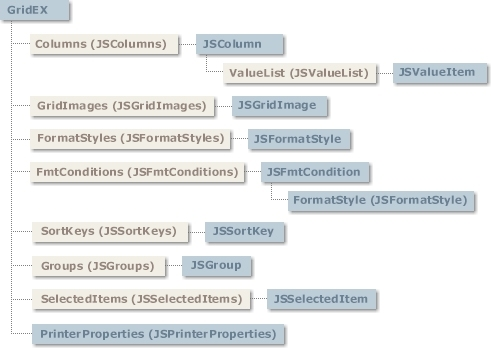

# Appendixes

## Janus GridEX 2000 (Object Model)

Click on any of the objects or collection labels above to jump to the top-level topic for the item.

- [GridEX Control](GridEX-Control.md#gridex-control)
- [JSColumns Collection](GridEX-Control/Objects/JSColumns-Collection.md#jscolumns-collection)
- [JSColumn Object](GridEX-Control/Objects/JSColumn-Object.md#jscolumn-object)
- [JSValueList Collection](GridEX-Control/Objects/JSValueList-Collection.md#jsvaluelist-collection)
- [JSValueItem Object](GridEX-Control/Objects/JSValueItem-Object.md#jsvalueitem-object)
- [JSGridImages Collection](GridEX-Control/Objects/JSGridImages-Collection.md#jsgridimages-collection)
- [JSGridImage Object](GridEX-Control/Objects/JSGridImage-Object.md#jsgridimage-object)
- [JSFormatStyles Collection](GridEX-Control/Objects/JSFormatStyles-Collection.md#jsformatstyles-collection)
- [JSFormatStyle Object](GridEX-Control/Objects/JSFormatStyle-Object.md#jsformatstyle-object)
- [JSFmtConditions Collection](GridEX-Control/Objects/JSFmtConditions-Collection.md#jsfmtconditions-collection)
- [JSFmtCondition Object](GridEX-Control/Objects/JSFmtCondition-Object.md#jsfmtcondition-object)
- [JSSortKeys Collection](GridEX-Control/Objects/JSSortKeys-Collection.md#jssortkeys-collection)
- [JSSortKey Object](GridEX-Control/Objects/JSSortKey-Object.md#jssortkey-object)
- [JSGroups Collection](GridEX-Control/Objects/JSGroups-Collection.md#jsgroups-collection)
- [JSGroup Object](GridEX-Control/Objects/JSGroup-Object.md#jsgroup-object)
- [JSSelectedItems Collection](GridEX-Control/Objects/JSSelectedItems-Collection.md#jsselecteditems-collection)
- [JSSelectedItem Object](GridEX-Control/Objects/JSSelectedItem-Object.md#jsselecteditem-object)
- [Orientation Property](GridEX-Control/Objects/JSPrinterProperties-Object.md#orientation-property-jsprinterproperties-object)
