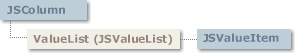

# JSColumn Object

## JSColumn Object

  
 Represents a column within a **GridEX** control.

### Syntax

 *gridex*.**Columns**(*index*)  
 The **JSColumn** object syntax has these parts:

| Part | Description |
| --- | --- |
| *gridex* | An object expression that evaluates to a **GridEX** control. |
| *index* | Either an integer or string that uniquely identifies a member of an object collection. An integer would be the value of the **Index** property; a string would be the value of the **Key** property. |

### Remarks

 With a **JSColumn** object, you can modify attributes of the column header as well as the column cells. A **JSColumn** object in the **GridEX** control also represents a field (a row) in a card.  
 To use individual **JSColumn** objects, you can use the **Columns** property of the **GridEX** control to obtain them. You can also assign a **JSColumn** to a separate variable dimensioned as a **JSColumn**.  
 The following shows both ways:

```vb
Dim colTemp as JSColumn

Set colTemp = GridEX1.Columns(1)
colTemp.Caption = "Column 1"
Debug.Print ( colTemp.Caption = GridEX1.Columns(1).Caption )
'Prints True
```

- [JSValueList Collection](JSValueList-Collection.md#jsvaluelist-collection)
- [JSValueItem Object](JSValueItem-Object.md#jsvalueitem-object)

**See Also:** [JSColumns Collection](JSColumns-Collection.md#jscolumns-collection), [Item Property](JSColumns-Collection.md#item-property-jscolumns-collection), [ItemByPosition Method](JSColumns-Collection.md#itembyposition-method-jscolumns-collection), [Columns Property](../Properties.md#columns-property-gridex-control)

## AggregateFunction Property (JSColumn Object)

Returns or sets the aggregate function to be shown in group footers for a column.

### Syntax

 *object*.**AggregateFunction** [ = *value*]  
 The **AggregateFunction** property syntax has these parts:

| Part | Description |
| --- | --- |
| *object* | An object expression that evaluates to an object in the Applies To list. |
| *value* | A value or constant that determines wich aggregate function is applied in a column, as described in settings. |

### Settings

 The settings for value are:

| Constant | Value | Description |
| --- | --- | --- |
|  **jgexAggregateNone** | 0 | Default. Displays nothing in the group footer. |
|  **jgexCount** | 1 | Displays the count of records in a group. |
|  **jgexSum** | 2 | Displays the sum of values in a group for the column. |
|  **jgexAvg** | 3 | Displays the average of the values in a group for the column. |
|  **jgexMin** | 4 | Displays the minimum value in a group for the column. |
|  **jgexMax** | 5 | Displays the maximum value in a group for the column. |
|  **jgexStdDev** | 6 | Displays the standard deviation in a group for the column. |
|  **jgexValueCount** | 7 | Displays the count of record with non-null values in a group for the column. |

### Remarks

 In adition to the **AggregateFunction** property, **GroupFooterStyle** must be set to **jgexTotalsGroupFooter**.  
 You can specify the format of the result in the group footer using the **TotalRowFormat** property and a text to be appended at the begining of the total like "SUM=" or "AVG=" using the **TotalRowPrefix** property.

**Applies To:** [JSColumn Object](#jscolumn-object)  
**See Also:** [GroupFooterStyle Property](../Properties.md#groupfooterstyle-property-gridex-control), [TotalRowFormat Property](#totalrowformat-property-jscolumn-object), [TotalRowPrefix Property](#totalrowprefix-property-jscolumn-object), [SubTotal Method](JSRowData-Object.md#subtotal-method-jsrowdata-object)  
**Example:** [ColumnTotalRowFormat Example](../../Examples.md#columntotalrowformat-example)

## AllowSizing Property (JSColumn Object)

Returns or sets a value indicating whether a user can resize a column in the **GridEX** control at run-time.

### Syntax

 *object*.**AllowSizing** [ = *value*]  
 The **AllowSizing** property syntax has these parts:

| Part | Description |
| --- | --- |
| *object* | An object expression that evaluates to an object in the Applies To list. |
| *value* | A Boolean expression that determines whether a column can be resized, as described in Settings. |

### Settings

 The settings for value are:

| Setting | Description |
| --- | --- |
| **True** | (Default) User can resize the column. |
| **False** | User can't resize the column. |

### Remarks

 If the **AllowSizing** property is **True**, the mouse pointer turns into a horizontal splitting (Size WE) arrow when positioned over the divider of the specified column, and the user can resize the column by dragging. Any change in the column width causes a **ColResize** event.

### Data Type

 Boolean

**Applies To:** [JSColumn Object](#jscolumn-object)  
**See Also:** [ColResize Event](../Events.md#colresize-event-gridex-control), [ColumnAutoResize Property](../Properties.md#columnautoresize-property-gridex-control), [Autosize Method](#autosize-method-jscolumn-object)

## ButtonStyle Property (JSColumn Object)

Returns or sets a value that defines if a cell in a column will display a button when the user enters edit mode.

### Syntax

 *object*.**ButtonStyle** [ = *value* ]  
 The **ButtonStyle** property syntax has these parts

| Part | Description |
| --- | --- |
| object | An object expression that evaluates to an object in the Applies To list |
| value | A value or constant that represents the type of button a cell will show (or whether no button is displayed) when the user enters edit mode, as described in Settings. |

**Settings**:  
 The settings for value are:

| Constant | Setting | Description |
| --- | --- | --- |
| **jgexNoButton** | 0 | (Default) The column does not display a button when the user edits a cell in it. |
| **jgexButtonEllipsis** | 1 | The column displays a button with ellipsis (“…”) aligned to the right of the cell when the user is editing a cell in it. |
| **jgexButtonDownArrow** | 2 | The column displays a button with a down-pointing arrow aligned to the right of the cell (as in a combo box) when the user is editing a cell in it. |

**Remarks**:  
 When a column has its **ButtonStyle** property set to **jgexButtonEllipsis** or **jgexButtonDownArrow** **ButtonStyle**, a **ColButtonClick** event is triggered when the user clicks in the button.

**Note:** This property has no effect in columns with drop-down or calendar drop-down edit types.

### Data Type

 **jgexButtonStyleConstants**

**Applies To:** [JSColumn Object](#jscolumn-object)  
**See Also:** [ColButtonClick Event](../Events.md#colbuttonclick-event-gridex-control)  
**Example:** [ColButtonClick Example](../../Examples.md#colbuttonclick-example)

## Caption Property (JSColumn Object)

Returns or sets the text displayed in the column's heading area.

### Syntax

 *object*.**Caption** [ = *value*]  
 The **Caption** property syntax has these parts:

| Part | Description |
| --- | --- |
| object | An object expression that evaluates to an object in the Applies To list. |
| value | A string expression that determines what is displayed, as described below. |

### Remarks

 Setting the **Caption** property to an empty string for a **JSColumn** object clears the text in the column's heading area but does not hide the heading.  
 Column captions are displayed only when the **GridEX** control's **ColumnHeaders** property is set to **True**.  
 The **Caption** string is also displayed in a card if the column’s **ShowCaptionInCardView** property is set to **True**.

### Data Type

 String

**Applies To:** [JSColumn Object](#jscolumn-object)  
**See Also:** [HeaderAlignment Property](#headeralignment-property-jscolumn-object), [TextAlignment Property](#textalignment-property-jscolumn-object), [HeaderIcon Property](#headericon-property-jscolumn-object), [ShowCaptionInCardView Property](#showcaptionincardview-property-jscolumn-object)  
**Example:** [ColumnCaption Example](../../Examples.md#columncaption-example)

## CardCaption Property (JSColumn Object)

Returns or sets whether a column’s value will be displayed in the card caption bar while the **GridEX** is in card view.

### Syntax

 *object*.**CardCaption** [ = *value*]  
 The **CardCaption** property syntax has these parts:

| Part | Description |
| --- | --- |
| *object* | An object expression that evaluates to an object in the Applies To list. |
| *value* | A Boolean that determines if the value of this column is displayed in the card caption as described in Settings. |

### Settings

 The settings for value are

| Setting | Description |
| --- | --- |
| **True** | The column’s value will be displayed in the card caption. |
| **False** | The column’s value will not be displayed in the card caption. |

### Remarks

 If you set a column’s **CardCaption** property to **True**, the column that formerly had this property set to **True** will change to **False**, since only one column can have its **CardCaption** property set to **True** at any given time.  
 Even when a column’s **CardCaption** property is **True**, the column will appear in the card body except if you set its **Visible** property to **False**.  
 This property has no effect if a **GridEX** control is in table view.

### Data Type

 Boolean

**Applies To:** [JSColumn Object](#jscolumn-object)  
**See Also:** [Caption Property](#caption-property-jscolumn-object), [CardCaptionPrefix Property](../Properties.md#cardcaptionprefix-property-gridex-control), [CardIcon Property](#cardicon-property-jscolumn-object)

## CardIcon Property (JSColumn Object)

Returns or sets whether a column’s icon will be displayed in the card caption while the GridEX is in card view.

### Syntax

 *object*.**CardIcon** [ = *value*]  
 The **CardIcon** property syntax has these parts:

| Part | Description |
| --- | --- |
| *object* | An object expression that evaluates to an object in the Applies To list. |
| *value* | A Boolean that determines if the icon of a column is displayed in the card caption. As described in settings. |

### Settings

 The settings for value are

| Setting | Description |
| --- | --- |
| **True** | The column’s icon will be displayed in the card caption. |
| **False** | The column’s icon will not be displayed in the card caption. |

### Remarks

 If you set a column’s **CardIcon** property to **True**, the column that formerly had this property set to **True** will change to **False**, since only one column can have its **CardIcon** property set to **True** at any given time.  
 Even when a column’s **CardIcon** property is set to **True**, the column will appear in the card body, except when you set its **Visible** property to **False**.  
 This property has no effect if a **GridEX** control is in table view.

### Data Type

 Boolean

**Applies To:** [JSColumn Object](#jscolumn-object)  
**See Also:** [CardCaptionPrefix Property](../Properties.md#cardcaptionprefix-property-gridex-control), [DefaultIcon Property](#defaulticon-property-jscolumn-object), [CardCaption Property](#cardcaption-property-jscolumn-object)

## CellStyle Property (JSColumn Object)

Returns or sets the name of the **JSFormatStyle** to be applied in all the cells in a column.

### Syntax

 *object*.**CellStyle** [ = *value*]  
 The **CellStyle** property syntax has these parts:

| Part | Description |
| --- | --- |
| *object* | An object expression that evaluates to an object in the Applies To list. |
| *value* | A String that represents the name of a JSFormatStyle in the JSFormatStyles collection to be applied in all the cells in a column. |

### Remarks

 Use this property to have different formats for columns in a **GridEX** control. Prior to set this property, a **JSFormatStyle** with its Name equal to the value of the property must be present in the **JSFormatStyles** collection.

**Applies To:** [GridEX Control](../../GridEX-Control.md#gridex-control)  
**See Also:** [Name Property](JSFormatStyle-Object.md#name-property-jsformatstyle-object), [JSFormatStyle Object](JSFormatStyle-Object.md#jsformatstyle-object), [RowStyle Property](JSRowData-Object.md#rowstyle-property-jsrowdata-object), [CellStyle Property](JSRowData-Object.md#cellstyle-property-jsrowdata-object), [HeaderStyle Property](#headerstyle-property-jscolumn-object)  
**Example:** [CellStyle Example](../../Examples.md#cellstyle-example)

## ColPosition Property (JSColumn Object)

Returns or sets the position of a column in a **GridEX** control.

### Syntax

 *object*.**ColPosition** [ = *value* ]  
 The **ColPosition** property syntax has these parts:

| Part | Description |
| --- | --- |
| *object* | An object expression that evaluates to an object in the Applies To list. |
| *value* | An integer that represents the position of a column in a **GridEX** control. |

### Remarks

 When a column has changed its position, only the **ColPosition** property changes while the **Index** property of the column remains the same. If you want to retrieve a **JSColumn** object by its position, use the **ItemByPosition** method in the **JSColumns** collection.

### Data Type

 Integer

**Applies To:** [JSColumn Object](#jscolumn-object)  
**See Also:** [Index Property](#index-property-jscolumn-object), [ItemByPosition Method](JSColumns-Collection.md#itembyposition-method-jscolumns-collection)  
**Example:** [Columns Example](../../Examples.md#columns-example)

## ColumnType Property (JSColumn Object)

Returns or sets how column contents will be displayed.

### Syntax

 *object*.**ColumType** [ = *value*]  
 The **ColumnType** property syntax has these parts:

| Part | Description |
| --- | --- |
| *object* | An object expression that evaluates to an object in the Applies To list. |
| *value* | A value or constant that determines how column is displayed, as described in Settings. |

### Settings

 The settings for value are:

| Constant | Value | Description |
| --- | --- | --- |
| **jgexText** | 0 | (Default) The cells of the column will display only text. |
| **jgexIcon** | 1 | The cells of the column will display only icons. |
| **jgexIconAndText** | 2 | The cells of the column will display icons and text. |
| **jgexCheckBox** | 3 | The cells of the column will appear as an embedded check box |

**Remarks**:  
 If a column’s type is **jgexIcon** or **jgexIconAndText**, the **GridEX** will display the icon whose **Index** is specified in the **DefaultIcon** property.  
 If the column has a **ValueList**, the **IconIndex** linked to the cell value will be used. Also, if the column’s **FetchIcon** property is set to **True**, the **JSGridImage** whose **Index** was specified in the **FetchIcon** event is used.

### Data Type

 **jgexColumnTypeConstants**

**Applies To:** [JSColumn Object](#jscolumn-object)  
**See Also:** [EditType Property](#edittype-property-jscolumn-object), [SortType Property](#sorttype-property-jscolumn-object)  
**Example:** [ColumnAdd Example](../../Examples.md#columnadd-example)

## DataChanged Property (JSColumn Object)

Returns or sets a value indicating that the data in a **GridEX** control has been changed by some process other than by retrieving data from the current record. Not available at design time.

### Syntax

 *object*.**DataChanged** [ = *value*]  
 The DataChanged property syntax has these parts:

| Part | Description |
| --- | --- |
| *object* | An object expression that evaluates to an object in the Applies To list. |
| *value* | A Boolean expression that indicates whether data has changed, as described in Settings. |

### Settings

 The settings for value are:

| Setting | Description |
| --- | --- |
| **True** | The data currently in the control is not the same as in the current record. |
| **False** | (Default) The data currently in the control, if any, is the same as the data in the current record. |

### Remarks

 When the user has made changes to current record in a **GridEX** control, the **DataChanged** property is set to **True** and before the user moves to another record the control will try to write those changes in the database.  
 If you do not wish to save changes to the database, you can set the **DataChanged** property to False.

### Data Type

 Boolean

**Applies To:** [JSColumn Object](#jscolumn-object)  
**See Also:** [Value Property](../Properties.md#value-property-gridex-control), [DataChanged Property](../Properties.md#datachanged-property-gridex-control)

## DataField Property (JSColumn Object)

Returns or sets a value that represents a field in the underlying **Recordset** object of a **GridEX**  
 control.

### Syntax

 *object*.**DataField** [ = *value* ]  
 The **DataField** property syntax has these parts:

| Part | Description |
| --- | --- |
| *object* | An object expression that evaluates to an object in the Applies To list. |
| *value* | A string expression that evaluates to the name of one of the fields in the **Recordset** object of a **GridEX** control. |

### Remarks

 If a column’s **DataField** property doesn’t match with a field in the **Recordset** object no errors occur; however the column will appear empty and any changes made to that column will not be committed.  
 In unbound mode, this property could be used as a **Tag** property for the column.

### Data Type

 String

**Applies To:** [JSColumn Object](#jscolumn-object)  
**See Also:** [ADORecordset Property](../Properties.md#adorecordset-property-gridex-control), [Recordset Property](../Properties.md#recordset-property-gridex-control)  
**Example:** [ColumnAdd Example](../../Examples.md#columnadd-example)

## DefaultIcon Property (JSColumn Object)

Returns or sets the index of the **JSGridImage** displayed in the cells of the column.

### Syntax

 *object*.**DefaultIcon** [ = *value* ]  
 The **DefaultIcon** syntax has these parts:

| Part | Description |
| --- | --- |
| *object* | An objects expression that evaluates to an object in the Applies To list. |
| *value* | An integer that refers to the index of the **JSGridImage** that will be used as default. |

### Remarks

 Use this property when you want a column that always displays the same icon for all records, instead of using the **FetchIcon** event.  
 If the column’s **FetchIcon** property setting is **True** the icon displayed will be the one retrieved in the **FetchIcon** event for that column.

**Note** If you try to set this property in a column whose type is text or check box an error occurs.

### Data Type

 Integer

**Applies To:** [JSColumn Object](#jscolumn-object)  
**See Also:** [IconIndex Property](JSValueItem-Object.md#iconindex-property-jsvalueitem-object), [IconIndex Property](JSRowData-Object.md#iconindex-property-jsrowdata-object), [FetchIcon Property](#fetchicon-property-jscolumn-object)  
**Example:** [GridImages Example](../../Examples.md#gridimages-example)

## DefaultValue Property (JSColumn Object)

Returns or sets the default value of a column in a new record.

### Syntax

 *object*.**DefaultValue** [ = *value*]  
 The **DefaultValue** property syntax has these parts:

| Part | Description |
| --- | --- |
| *object* | An object expression that evaluates to an object in the Applies To list. |
| *value* | A variant that defines the default value of a column in a new record. |

### Remarks

 Use this property in the columns where you want to assign a default value for fields in a new record.  
 The default value will only appear when the “new record” row is the current row.

### Data Type

 Variant

**Applies To:** [JSColumn Object](#jscolumn-object)  
**See Also:** [DataField Property](#datafield-property-jscolumn-object)  
**Example:** [ColFormat Example](../../Examples.md#colformat-example)

## DropDownControl Property (JSColumn Object)

Returns or sets the **GridEX** control that acts as a drop down list for the column.

### Syntax

 *object*.**DropDownControl** [= *value* ]  
 The **DropDownControl** property syntax has these parts:

| Part | Description |
| --- | --- |
| *object* | An object expression that evaluates to an object in the Applies To list. |
| *value* | A **GridEX** control that represents the control that acts as a drop down list for the column. |

### Remarks

 To have a **DropDownControl** working with a column, the column's **EditType** property must be equal to **jgexEditCombo** and the **ActAsDropDown** propertuy of the **GridEX** control set as the **DropDownControl** must be equal to **True**. In adition, **BoundColumnIndex** and **ReplaceColumnIndex** must be specified in the drop down **GridEX** control.

### Data Type

 Object

**Applies To:** [JSColumn Object](#jscolumn-object)  
**Example:** [ActAsDropDown Example](../../Examples.md#actasdropdown-example)

## EditType Property (JSColumn Object)

Returns or sets how a column is edited by the user.

### Syntax

 *object*.**EditType** [ = *value*]  
 The **EditType** property syntax has these parts:

| Part | Description |
| --- | --- |
| *object* | An object expression that evaluates to an object in the Applies To list. |
| *value* | A value or constant that determines how column is edited, as described in settings. |

### Settings

 The settings for value are:

| Constant | Value | Description |
| --- | --- | --- |
|  **jgexEditCustom** | -1 | The control will trigger custom edit events whenever the user tries to edit a cell in the column in order to allow you the use of any control to edit cells. |
|  **jgexEditNone** | 0 | The column is read-only. |
|  **jgexEditTextBox** | 1 | (Default) When the user tries to edit a column, a text box appears. |
|  **jgexEditCheckBox** | 2 | The column will present a check box for editing. |
|  **jgexEditDropDow** | 3 | The column will present a drop down list for editing. |
|  **jgexEditCalendarDropDown** | 4 | The column will present a text box with a drop-down calendar for editing. |
| **jgexEditCombo** | 5 | The column will present a combo box using as its list another **GridEX** control specified in the **DropDownControl** property |

### Remarks

 When the **ColumnType** property setting is **jgexEditDropDown** the values for the drop down list are retrieved from the **ValueList** of the column.  
 Some of the edit types cannot be used for all column types. The possible combinations of these two properties are given in the following table:

| ColumnType | Possible EditType settings |
| --- | --- |
| Icon<br> **(ColumnType = jgexIcon)** | **jgexEditNone<br> jgexEditDropDown** |
| Text<br> **(ColumnType = jgexText)** | **jgexEditNone<br> jgexEditTextBox<br> jgexEditDropDown<br> jgexEditCalendarDropDown<br> jgexEditCombo** |
| Icon and text<br> **(ColumnType = jgexIconAndText)** | **jgexEditNone<br> jgexEditTextBox<br> jgexEditDropDown<br> jgexEditCalendarDropDown<br> jgexEditCombo** |
| Check Box<br> **(ColumnType = jgexCheckBox)** | **jgexEditNone<br> jgexEditCheckBox** |

**Applies To:** [JSColumn Object](#jscolumn-object)  
**See Also:** [ColumnType Property](#columntype-property-jscolumn-object), [SortType Property](#sorttype-property-jscolumn-object)  
**Example:** [CustomEdit Example](../../Examples.md#customedit-example)

## FetchData Property (JSColumn Object)

Returns or sets whether the **FetchData** event will be fired for a column.

### Syntax

 *object*.**FetchData** [ = *value* ]  
 The **FetchData** property syntax has these parts:

| Part | Description |
| --- | --- |
| *object* | An object expression that evaluates to an object in the Applies To list. |
| *value* | A Boolean expression that controls whether the **FetchData** event will be fired for the column, as described in settings. |

**Settings**:  
 The settings for value are:

| Setting | Description |
| --- | --- |
| **True** | The **FetchData** event will be fired any time the **GridEX** control needs the value for a cell in the column. |
| **False** | (Default) The value of a cell in the column will be retrieved from the **Recordset**. |

### Remarks

 This property has effect only in DAO and ADO modes.  
 Use this property when you want a column that displays a calculated value.

### Data Type

 Boolean

**Applies To:** [GridEX Control](../../GridEX-Control.md#gridex-control)  
**See Also:** [FetchData Event](../Events.md#fetchdata-event-gridex-control), [FetchIcon Event](../Events.md#fetchicon-event-gridex-control), [FetchIcon Property](#fetchicon-property-jscolumn-object)  
**Example:** [FetchData Example](../../Examples.md#fetchdata-example)

## FetchIcon Property (JSColumn Object)

Returns or sets whether the **FetchIcon** event will be fired for a column.

### Syntax

 *object*.**FetchIcon** [ = *value* ]  
 The **FetchIcon** property syntax has these parts:

| Part | Description |
| --- | --- |
| *object* | An object expression that evaluates to an object in the Applies To list. |
| *value* | A Boolean expression that controls whether the **FetchIcon** event will be fired for the column, as described in settings |

### Settings

 The settings for value are:

| Setting | Description |
| --- | --- |
| **True** | The **FetchIcon** event will be fired any time the **GridEX** control needs the **JSGridImage** index for a cell in the column. |
| **False** | (Default) No **FetchIcon** event is fired for the column. |

### Remarks

 This property can only be set to **True** if the column’s **ColumnType** property is either **jgexIcon** or **jgexIconAndText**.  
 Use this property when you want to display different icons in a column.

### Data Type

 Boolean

**Applies To:** [JSColumn Object](#jscolumn-object)  
**See Also:** [FetchData Event](../Events.md#fetchdata-event-gridex-control), [FetchData Property](#fetchdata-property-jscolumn-object), [FetchIcon Event](../Events.md#fetchicon-event-gridex-control)  
**Example:** [FetchIcon Example](../../Examples.md#fetchicon-example)

## Format Property (JSColumn Object)

Returns or sets a value indicating the format string for the **JSColumn** object of a **GridEX** control.

### Syntax

 *object*.**Format** [ = *value*]  
 The **Format** property syntax has these parts:

| Part | Description |
| --- | --- |
| *object* | An object expression that evaluates to an object in the Applies To list. |
| *value* | A string expression that defines how the values for the column are formatted. <br> The default value is a zero-length string (""). |

### Remarks

 See the Visual Basic Format function for information about valid format strings.

### Data Type

 String

**Applies To:** [JSColumn Object](#jscolumn-object)  
**See Also:** [GroupFormat Property](#groupformat-property-jscolumn-object), [TotalRowFormat Property](#totalrowformat-property-jscolumn-object)  
**Example:** [ColFormat Example](../../Examples.md#colformat-example)

## GroupEmptyStringCaption Property (JSColumn Object)

Returns or sets the string displayed in a group row when the value grouped is an empty string.

### Syntax

 *object*.**GroupEmptyStringCaption** [ = *value* ]  
 The **GroupEmptyStringCaption** syntax has these parts:

| Part | Description |
| --- | --- |
| *object* | An object expression that evaluates to an object in the Applies To list. |
| *value* | A string expression that defines the text that will be displayed in the group row when the value of the group is an empty string or a Null value. The default value is “(none)” |

### Remarks

 Use this property if you want to display some informational text in a group whose value is an empty string or Null.

### Data Type

 String

**Applies To:** [JSColumn Object](#jscolumn-object)  
**See Also:** [RowType Property](JSRowData-Object.md#rowtype-property-jsrowdata-object), [SubTotal Method](JSRowData-Object.md#subtotal-method-jsrowdata-object), [GroupPrefix Property](#groupprefix-property-jscolumn-object), [GroupFormat Property](#groupformat-property-jscolumn-object), [GroupCaption Property](JSRowData-Object.md#groupcaption-property-jsrowdata-object)

## GroupFormat Property (JSColumn Object)

Returns or sets a string that represents the format value of the grouping for rows when a **GridEX** control is grouped by a given column.

### Syntax

 *object*.**GroupFormat** [ = *value* ]  
 The **GroupFormat** property syntax has these parts:

| Part | Description |
| --- | --- |
| *object* | An object expression that evaluates to an object in the Applies To list. |
| *value* | A string expression that defines how the value of the group rows is formatted. The default value is a zero-length string (""). |

### Remarks

 In some cases, you may want to have different formats for a value when it is presented as a cell or as a group row value. For example, a column with dates may have its **Format** property set to “Medium Date” and its **GroupFormat** property set to “mmmm yyyy” in order to group records on a Month-Year basis, rather than mm/dd/yy.  
 See the Visual Basic Format function for information about valid format strings.

### Data Type

 String

**Applies To:** [JSColumn Object](#jscolumn-object)  
**See Also:** [Format Property](#format-property-jscolumn-object), [GroupEmptyStringCaption Property](#groupemptystringcaption-property-jscolumn-object), [TotalRowFormat Property](#totalrowformat-property-jscolumn-object), [RowType Property](JSRowData-Object.md#rowtype-property-jsrowdata-object), [SubTotal Method](JSRowData-Object.md#subtotal-method-jsrowdata-object), [GroupPrefix Property](#groupprefix-property-jscolumn-object), [GroupFormat Property](#groupformat-property-jscolumn-object), [GroupCaption Property](JSRowData-Object.md#groupcaption-property-jsrowdata-object)  
**Example:** [ColFormat Example](../../Examples.md#colformat-example)

## GroupPrefix Property (JSColumn Object)

Returns or sets the string displayed in a group row before the group row value.

### Syntax

 *object*.**GroupPrefix** [ = *value*]  
 The **GroupPrefix** syntax has these parts:

| Part | Description |
| --- | --- |
| *object* | An object expression that evaluates to an object in the Applies To list. |
| *value* | A string expression that defines the text that will be displayed in a group row before the group value. The default value is a zero-length string (“”). |

### Remarks

 Use this property if you want to prefix some informational text to a group’s value.  
 For example, if you want to set the **GroupPrefix** property for each column in a **GridEX** control to its **Caption** property plus a “:” you can write code as follows:

```vb
Dim Col as JSColumn

For each Col in GridEX1.Columns
Col.GroupPrefix = Col.Caption & ":"
Next
```

### Data Type

 String

**Applies To:** [JSColumn Object](#jscolumn-object)  
**See Also:** [GroupFormat Property](#groupformat-property-jscolumn-object), [GroupEmptyStringCaption Property](#groupemptystringcaption-property-jscolumn-object), [GroupCaption Property](JSRowData-Object.md#groupcaption-property-jsrowdata-object)  
**Example:** [ColumnCaption Example](../../Examples.md#columncaption-example)

## HasValueList Property (JSColumn Object)

Controls whether a column has a list of values in a **GridEX** control.

### Syntax

 *object*.**HasValueList** [ = *value* ]  
 The **HasValueList** property syntax has these parts:

| Part | Description |
| --- | --- |
| *object* | An object expression that evaluates to an object in the Applies To list. |
| *value* | A Boolean expression that controls whether a column has a list of values as described in settings |

### Settings

 The settings for *value* are:

| Setting | Description |
| --- | --- |
| **True** | The column has a list of values for replacement. |
| **False** | (Default) The column does not have a list of values for replacement. |

### Remarks

 When you set a **JSColumn**’s **HasValueList** property to **False**, the **JSValueList** collection for that column is cleared and any reference to its **ValueList** property will return Nothing.

### Data Type

 Boolean

**Applies To:** [JSColumn Object](#jscolumn-object)  
**See Also:** [ReplaceValues Property](#replacevalues-property-jscolumn-object), [ValueList Property](#valuelist-property-jscolumn-object), [JSValueList Collection](JSValueList-Collection.md#jsvaluelist-collection)  
**Example:** [ValueList Example](../../Examples.md#valuelist-example)

## HeaderAlignment Property (JSColumn Object)

Returns or sets a value that determines the alignment of column’s header text of a GridEX control.

### Syntax

 *object*.**HeaderAlignment** [ = *value* ]  
 The **HeaderAlignment** property syntax has these parts:

| Part | Description |
| --- | --- |
| *object* | An object expression that evaluates to an object in the Applies To list. |
| *value* | A value or constant that specifies the type of alignment of a column, as described in Settings. |

### Settings

 The settings for *value* are:

| Constant | Value | Description |
| --- | --- | --- |
|  **jgexAlignLeft** | 0 | Text is left aligned. |
|  **jgexAlignCenter** | 1 | Text is centered. |
|  **jgexAlignRight** | 2 | Text is right aligned. |

### Data Type

 Integer

**Applies To:** [JSColumn Object](#jscolumn-object)  
**See Also:** [TextAlignment Property](#textalignment-property-jscolumn-object)  
**Example:** [ColumnAdd Example](../../Examples.md#columnadd-example)

## HeaderIcon Property (JSColumn Object)

Returns or sets the index of the **JSGridImage** displayed in the header of a column.

### Syntax

 *object*.**HeaderIcon** [ = *value* ]  
 The **HeaderIcon** syntax has these parts:

| Part | Description |
| --- | --- |
| *object* | An object expression that evaluates to an object in the Applies To list. |
| *value* | An integer that refers to the index of the **JSGridImage** that will be used in the column header. |

### Data Type

 Integer

**Applies To:** [JSColumn Object](#jscolumn-object)  
**See Also:** [DefaultIcon Property](#defaulticon-property-jscolumn-object), [CardIcon Property](#cardicon-property-jscolumn-object)  
**Example:** [GridImages Example](../../Examples.md#gridimages-example)

## HeaderStyle Property (JSColumn Object)

Returns or sets the name of the **JSFormatStyle** to be applied in the column header.

### Syntax

 *object*.**HeaderStyle** [ = *value*]  
 The **HeaderStyle** property syntax has these parts:

| Part | Description |
| --- | --- |
| *object* | An object expression that evaluates to an object in the Applies To list. |
| *value* | A String that represents the name of a **JSFormatStyle** in the **JSFormatStyles** collection to be applied in the column header. |

### Remarks

 Use this property to have different formats for column headers in a **GridEX** control.  
 Prior to set this property, a **JSFormatStyle** with its **Name** equal to the value of the property must be present in the **JSFormatStyles** collection.

**Applies To:** [JSColumn Object](#jscolumn-object)  
**See Also:** [HeaderStyle Property](../Properties.md#headerstyle-property-gridex-control), [JSFormatStyle Object](JSFormatStyle-Object.md#jsformatstyle-object)  
**Example:** [CellStyle Example](../../Examples.md#cellstyle-example)

## HeaderToolTip Property (JSColumn Object)

Returns or sets the text displayed in a tool tip when users moves the mouse pointer over a column header.

### Syntax

 *object*.**HeaderToolTip** [ = *value*]  
 The **HeaderToolTip** property syntax has these parts:

| Part | Description |
| --- | --- |
| *object* | An object expression that evaluates to an object in the Applies To list. |
| *value* | A string expression that determines the text displayed in a tool tip when users moves the mouse pointer over a column header. |

### Remarks

 Use this property to show tool tips for column headers.  
 If **ToolTipText** property is set to an empty string, no tooltip is displayed when the user hoovers over the column header.

### Data Type

 String

**Applies To:** [JSColumn Object](#jscolumn-object)  
**See Also:** [ShowToolTips Property](../Properties.md#showtooltips-property-gridex-control), [ScrollToolTips Property](../Properties.md#scrolltooltips-property-gridex-control), [ScrollToolTip Column Property](../Properties.md#scrolltooltip-column-property-gridex-control)  
**Example:** [ColumnAdd Example](../../Examples.md#columnadd-example)

## Index Property (JSColumn Object)

Returns a value that represents the index of an object in a collection. Read only.

### Syntax

 object.**Index**  
 The object placeholder represents an object expression that evaluates to an object in the Applies To list.

### Remarks

 The **Index** property for all collections is 1-based.

### Data Type

 Integer

**Applies To:** [JSColumn Object](#jscolumn-object)  
**See Also:** [ColPosition Property](#colposition-property-jscolumn-object), [Item Property](JSColumns-Collection.md#item-property-jscolumns-collection), [ItemByPosition Method](JSColumns-Collection.md#itembyposition-method-jscolumns-collection), [Remove Method](JSColumns-Collection.md#remove-method-jscolumns-collection), [ColIndex Property](JSGroup-Object.md#colindex-property-jsgroup-object), [ColIndex Property](JSSortKey-Object.md#colindex-property-jssortkey-object), [ColIndex Property](JSFmtCondition-Object.md#colindex-property-jsfmtcondition-object), [Count Property](JSColumns-Collection.md#count-property-jscolumns-collection)  
**Example:** [Columns Example](../../Examples.md#columns-example)

## IsGrouped Property (JSColumn Object)

Returns a value that indicates whether a column is grouped. Read only.

### Syntax

 *object*.**IsGrouped**  
 The object placeholder represents an object in the Applies To list.

### Settings

 The settings for **IsGrouped** property are:

| Setting | Description |
| --- | --- |
| **True** | At least one group in the **GridEX** control refers to the column. |
| **False** | No groups in a **GridEX** control refer to the column. |

### Data Type

 Boolean

**Applies To:** [JSColumn Object](#jscolumn-object)  
**See Also:** [ColIndex Property](JSGroup-Object.md#colindex-property-jsgroup-object), [JSGroups Collection](JSGroups-Collection.md#jsgroups-collection)  
**Example:** [ColumnHeaderClick Example](../../Examples.md#columnheaderclick-example)

## Key Property (JSColumn Object)

Returns or sets a string that uniquely identifies a member in a collection.

### Syntax

 *object*.**Key** [ = *string* ]  
 The **Key** property syntax has these parts:

| Part | Description |
| --- | --- |
| *object* | An object expression that evaluates to an object in the Applies To list. |
| string | A unique string identifying a member in a collection. |

### Remarks

 If the string is not unique within the collection, an error will occur.  
 You can set the **Key** property when you use the **Add** method to add an object to a collection.

### Data Type

 String

**Applies To:** [JSColumn Object](#jscolumn-object)  
**See Also:** [Add Method](JSColumns-Collection.md#add-method-jscolumns-collection), [Remove Method](JSColumns-Collection.md#remove-method-jscolumns-collection), [Item Property](JSColumns-Collection.md#item-property-jscolumns-collection), [Index Property](#index-property-jscolumn-object)

## MaxLength Property (JSColumn Object)

Returns or sets the maximum number of characters that can be entered in a column.

### Syntax

 *object*.**MaxLength** [ = *value*]  
 The **MaxLength** property syntax has these parts:

| Part | Description |
| --- | --- |
| *object* | An object expression that evaluates to an object in the Applies To list. |
| *value* | A Long expression that defines the maximum number of characters that can be entered in a column. |

### Remarks

 If text that exceeds the **MaxLength** property setting is assigned to a cell from code (using the value property), no error occurs; however, only the maximum number of characters is assigned to the cell, and extra characters are truncated.  
 Changing this property doesn't affect the contents of the cells retrieved from the database, it only limits the text the can be entered by a user.

### Data Type

 Long

**Applies To:** [JSColumn Object](#jscolumn-object)  
**See Also:** [EditType Property](#edittype-property-jscolumn-object)  
**Example:** [ColumnAdd Example](../../Examples.md#columnadd-example)

## MaxRowsInCardView Property (JSColumn Object)

Returns or sets the maximum number of rows displayed in a word wrap column.

### Syntax

 *object*.**MaxRowsInCardView** [ = *value*]  
 The **MaxRowsInCardView** property syntax has these parts:

| Part | Description |
| --- | --- |
| *object* | An object expression that evaluates to an object in the Applies To list. |
| *value* | A Long expression that defines the maximum numberof rows displayed in a word wrap column. |

### Remarks

 Use this property whenever you want to limit the number of rows displayed in a **WordWrap** field while the control is in card view.  
 This property is only used when **GridEX** is in card view.  
 When **WordWrap** property is equal to **False** in a column, this property has no effect.

### Data Type

 Long

**Applies To:** [JSColumn Object](#jscolumn-object)  
**See Also:** [MinRowsInCardView Property](#minrowsincardview-property-jscolumn-object), [WordWrap Property](#wordwrap-property-jscolumn-object)  
**Example:** [WordWrap Example](../../Examples.md#wordwrap-example)

## MinRowsInCardView Property (JSColumn Object)

Returns or sets the minimum number of rows displayed in a word wrap column.

### Syntax

 *object*.**MinRowsInCardView** [ = *value*]  
 The **MinRowsInCardView** property syntax has these parts:

| Part | Description |
| --- | --- |
| *object* | An object expression that evaluates to an object in the Applies To list. |
| *value* | A Long expression that defines the minimum number of rows displayed in a word wrap column. |

### Remarks

 Use this property whenever you want to have minimum of lines displayed in a **WordWrap** field while the control is in card view.  
 This property is only used when **GridEX** is in card view.  
 When **WordWrap** property is equal to **False** in a column, this property has no effect.

### Data Type

 Long

**Applies To:** [JSColumn Object](#jscolumn-object)  
**See Also:** [MaxRowsInCardView Property](#maxrowsincardview-property-jscolumn-object), [WordWrap Property](#wordwrap-property-jscolumn-object)  
**Example:** [WordWrap Example](../../Examples.md#wordwrap-example)

## NullBehavior Property (JSColumn Object)

Determines how empty cells in a column will be stored.

### Syntax

 *object*.**NullBehavior** [ = *value*]  
 The **NullBehavior** property syntax has these parts:

| Part | Description |
| --- | --- |
| *object* | An object expression that evaluates to an object in the Applies To list. |
| *value* | A value or constant that determines how empty cells are stored, as described in settings. |

### Settings

 The settings for *value* are:

| Constant | Value | Description |
| --- | --- | --- |
|  **jgexNBAutomatic** | 0 | (Default) An empty cell will be stored as an empty string for text or memo field whose Required property is **True**, and as Null for fields that are not required. |
|  **jgexNBNull** | 1 | Empty cells are stored as Null. |
|  **jgexNBEmptyString** | 2 | Empty cells are stored as an empty string (a zero length string).<br> |

### Data Type

 **jgexNullBehaviorConstants**

**Applies To:** [JSColumn Object](#jscolumn-object)  
**See Also:** [DataField Property](#datafield-property-jscolumn-object)  
**Example:** [ColumnAdd Example](../../Examples.md#columnadd-example)

## ReplaceValues Property (JSColumn Object)

Returns or sets whether the column values are replaced using the **JSValueList** for the column.

### Syntax

 *object*.**ReplaceValues** [ = *value* ]  
 The **ReplaceValues** property syntax has these parts:

| Part | Description |
| --- | --- |
| *object* | An object expression that evaluates to an object in the Applies To list. |
| *value* | A Boolean expression that controls whether column values are replaced as described in settings. |

### Settings

 The settings for value are:

| Setting | Description |
| --- | --- |
| **True** | (Default) Column values are replaced when the column’s **HasValueList** property setting is **True**. |
| **False** | Column values are not replaced. The **JSValueList** object is used only as entries in a drop-down list. |

### Remarks

 Use this property when you want to have a drop-down list for a column without the replacement functionality of the **JSValueList**.  
 This property has no effect when the **HasValueList** property setting is **False**.

### Data Type

 Boolean

**Applies To:** [JSColumn Object](#jscolumn-object)  
**See Also:** [HasValueList Property](#hasvaluelist-property-jscolumn-object), [ValueList Property](#valuelist-property-jscolumn-object), [JSValueList Collection](JSValueList-Collection.md#jsvaluelist-collection), [ReplaceColumnIndex Property](../Properties.md#replacecolumnindex-property-gridex-control), [ActAsDropDown Property](../Properties.md#actasdropdown-property-gridex-control), [EditType Property](#edittype-property-jscolumn-object), [BoundColumnIndex Property](../Properties.md#boundcolumnindex-property-gridex-control)  
**Example:** [DropList Example](../../Examples.md#droplist-example)

## Selectable Property (JSColumn Object)

Controls whether cells in a column can be selected in a **GridEX** control.

### Syntax

 *object*.**Selectable** [ = *value* ]  
 The **Selectable** property syntax has these parts:

| Part | Description |
| --- | --- |
| *object* | An object expression that evaluates to an object in the Applies To list. |
| *value* | A Boolean expression that controls whether cells in a column can be selected, as described in settings |

### Settings

 The settings for *value* are:

| Setting | Description |
| --- | --- |
| **True** | (Default) When the user clicks on a cell, the cell becomes the current cell. |
| **False** | When a cell is selected the next selectable column becomes the current cell. |

### Remarks

 Use this property in columns that should not be edited and should not be selected by the user. For example, when you have a non-editable icon column, you should normally set its **Selectable** property for this column to **False**.

### Data Type

 Boolean

**Applies To:** [JSColumn Object](#jscolumn-object)  
**See Also:** [EditType Property](#edittype-property-jscolumn-object)

## ShowCaptionInCardView Property (JSColumn Object)

Controls whether the caption of a column is displayed in the card body.

### Syntax

 *object*.**ShowCaptionInCardView** [ = *value*]  
 The **ShowCaptionInCardView** property syntax has these parts:

| Part | Description |
| --- | --- |
| *object* | An object expression that evaluates to an object in the Applies To list. |
| *value* | A Boolean expression that controls whether the caption of a column is displayed in a card as described in settings |

### Settings

 The settings for *value* are:

| Setting | Description |
| --- | --- |
| **True** | (Default) The caption of the column is displayed at the left of its value in a card. |
| **False** | Only the value of the column is displayed in a card. |

### Remarks

 If the **ShowCaptionInCardView** property setting is **False**, the value displayed for the column begins at the left margin of the card area.  
 This property has no effect while the **GridEX** control is in table view.

### Data Type

 Boolean

**Applies To:** [JSColumn Object](#jscolumn-object)  
**See Also:** [Visible Property](#visible-property-jscolumn-object), [HeaderStyle Property](#headerstyle-property-jscolumn-object), [View Property](../Properties.md#view-property-gridex-control)

## SortOrder Property (JSColumn Object)

Returns a value that represents the sort order of an object in a **GridEX** control. This property is read only for **JSColumn** objects.

### Syntax

 *object*.**SortOrder** [ = *value* ]  
 The **SortOrder** property syntax has these parts:

| Part | Description |
| --- | --- |
| *object* | An object expression that evaluates to an object in the Applies To list. |
| *value* | A value or constant that represents the sort order of an object as described in settings. |

### Settings

 The settings for *value* are:

| Constant | Value | Description |
| --- | --- | --- |
|  **jgexSortNone** | 0 | The column is not sorted. |
|  **jgexSortAscending** | 1 | The column is sorted in ascending order. |
|  **jgexSortDescending** | -1 | The column is sorted in descending order. |

### Remarks

 The **JSColumn**’s **SortOrder** property is set when a column is either sorted or grouped.

### Data Type

 **jgexSortOrderConstants**

**Applies To:** [JSColumn Object](#jscolumn-object)  
**See Also:** [SortOrder Property](JSGroup-Object.md#sortorder-property-jsgroup-object), [SortOrder Property](JSSortKey-Object.md#sortorder-property-jssortkey-object), [SortType Property](#sorttype-property-jscolumn-object)  
**Example:** [ColumnHeaderClick Example](../../Examples.md#columnheaderclick-example)

## SortType Property (JSColumn Object)

Returns or sets a value that indicates the way a **GridEX** control sorts the values for a column.

### Syntax

 *object*.**SortType** [ = *value* ]  
 The **SortType** property syntax has these parts:

| Part | Description |
| --- | --- |
| *object* | An object expression that evaluates to an object in the Applies To list. |
| *value* | A constant that represents the way a **GridEX** control sorts values in a column as described in Settings |

### Settings

 The settings for *value* are:

| Constant | Value | Description |
| --- | --- | --- |
|  **jgexSortTypeString** | 1 | (Default) Values are sorted as strings. |
|  **jgexSortTypeNumeric** | 2 | Values are sorted as numbers. Any non-numeric value is evaluated as 0. |
|  **jgexSortTypeDate** | 3 | Values are sorted as dates. The default grouping interval is one day. |
|  **jgexSortTypeDateTime** | 4 | Values are sorted as dates and times. The grouping interval is one second. |
|  **jgexSortTypeTime** | 5 | Values are sorted using the time part of a date and discarding the date. The grouping interval is one second. |

### Data Type

 Integer

**Applies To:** [JSColumn Object](#jscolumn-object)  
**See Also:** [ColumnType Property](#columntype-property-jscolumn-object), [EditType Property](#edittype-property-jscolumn-object), [SortOrder Property](JSGroup-Object.md#sortorder-property-jsgroup-object), [SortOrder Property](JSSortKey-Object.md#sortorder-property-jssortkey-object), [SortOrder Property](#sortorder-property-jscolumn-object)  
**Example:** [ColumnAdd Example](../../Examples.md#columnadd-example)

## Tag Property (JSColumn Object)

Returns or sets an expression that stores any extra data needed for your program.  
 Unlike other properties, the value of the **Tag** property is not used by the **GridEX** control; you can use this property to identify objects.

### Syntax

 *object*.**Tag** [ = *expression* ]  
 The **Tag** property syntax has these parts:

| Part | Description |
| --- | --- |
| *object* | An object expression that evaluates to an object in the Applies To list. |
| *expression* | A string expression identifying the object. The default is a zero-length string (""). |

### Remarks

 You can use this property to assign an identification string to an object without affecting any of its other property settings or causing side effects.

### Data Type

 String

**Applies To:** [JSColumn Object](#jscolumn-object)  
**See Also:** [DataField Property](#datafield-property-jscolumn-object), [Key Property](#key-property-jscolumn-object)

## TextAlignment Property (JSColumn Object)

Returns or sets a value that determines the alignment of text in a column of a GridEX control.

### Syntax

 *object*.**TextAlignment** [ = *value* ]  
 The **TextAlignment** property syntax has these parts:

| Part | Description |
| --- | --- |
| *object* | An object expression that evaluates to an object in the Applies To list. |
| *value* | A value or constant that specifies the type of alignment of a column, as described in Settings. |

### Settings

 The settings for *value* are:

| Constant | Value | Description |
| --- | --- | --- |
|  **jgexAlignLeft** | 0 | Text is left aligned. |
|  **jgexAlignCenter** | 1 | Text is centered. |
|  **jgexAlignRight** | 2 | Text is right aligned. |

### Data Type

 Integer

**Applies To:** [JSColumn Object](#jscolumn-object)  
**See Also:** [TextAlignment Property](JSFormatStyle-Object.md#textalignment-property-jsformatstyle-object), [HeaderAlignment Property](#headeralignment-property-jscolumn-object)

## TotalRowFormat Property (JSColumn Object)

Returns or sets a value indicating the format string for the aggregate function result of a column in the group footer row.

### Syntax

 *object*.**TotalRowFormat** [ = *value*]  
 The **TotalRowFormat** property syntax has these parts:

| Part | Description |
| --- | --- |
| *object* | An object expression that evaluates to an object in the Applies To list. |
| *value* | A string expression that defines how the values for the column in the group footer row are formatted. The default value is a zero-length string (""). |

### Remarks

 See the Visual Basic Format function for information about valid format strings.

### Data Type

 String

**Applies To:** [JSColumn Object](#jscolumn-object)  
**See Also:** [GroupFooterStyle Property](../Properties.md#groupfooterstyle-property-gridex-control), [TotalRowPrefix Property](#totalrowprefix-property-jscolumn-object), [SubTotal Method](JSRowData-Object.md#subtotal-method-jsrowdata-object), [AggregateFunction Property](#aggregatefunction-property-jscolumn-object)  
**Example:** [ColumnTotalRowFormat Example](../../Examples.md#columntotalrowformat-example)

## TotalRowPrefix Property (JSColumn Object)

Returns or sets the string displayed in a group footer row before the aggregate function result.

### Syntax

 *object*.**TotalRowPrefix** [ = *value*]  
 The **TotalRowPrefix** syntax has these parts:

| Part | Description |
| --- | --- |
| *object* | An object expression that evaluates to an object in the Applies To list. |
| *value* | A string expression that defines the text that will be in a group footer row before the aggregate function result.. The default value is a zero-length string (“”). |

### Remarks

 Use this property if you want to prefix some informational text to the value in a column of a group footer row. For example, if you have a column with **AggregateFunction** set to **jgexSum** you may set the **RowTotalPrefix** property to "SUM=" to indicate the user the meaning of the value.

### Data Type

 String

**Applies To:** [JSColumn Object](#jscolumn-object)  
**See Also:** [GroupFooterStyle Property](../Properties.md#groupfooterstyle-property-gridex-control), [TotalRowFormat Property](#totalrowformat-property-jscolumn-object), [SubTotal Method](JSRowData-Object.md#subtotal-method-jsrowdata-object), [AggregateFunction Property](#aggregatefunction-property-jscolumn-object)  
**Example:** [ColumnTotalRowFormat Example](../../Examples.md#columntotalrowformat-example)

## ValueList Property (JSColumn Object)

Returns the **JSValueList** collection associated with a column of a **GridEX** control.

### Syntax

 *object*.**ValueList**  
 The object placeholder represents an object expression that evaluates to an object in the Applies To list.

### Remarks

 This property returns Nothing if the **HasValueList** property of the column is set to False.

### Data Type

 **JSValueList**

**Applies To:** [JSColumn Object](#jscolumn-object)  
**See Also:** [HasValueList Property](#hasvaluelist-property-jscolumn-object), [ReplaceValues Property](#replacevalues-property-jscolumn-object), [JSValueList Collection](JSValueList-Collection.md#jsvaluelist-collection)  
**Example:** [ValueList Example](../../Examples.md#valuelist-example)

## Visible Property (JSColumn Object)

Returns or sets a value indicating whether an object is visible or hidden.

### Syntax

 *object*.**Visible** [ = *boolean* ]  
 The **Visible** property syntax has these parts:

| Part | Description |
| --- | --- |
| *object* | An object expression that evaluates to an object in the Applies To list. |
| *boolean* | A Boolean expression specifying whether the object is visible or hidden. |

### Settings

The settings for *boolean* are:

| Setting | Description |
| --- | --- |
| **True** | (Default) Object is visible. |
| **False** | Object is hidden. |

### Remarks

 You can use this property to hide or show individual **JSColumn** objects selectively.

### Data Type

 Boolean

**Applies To:** [JSColumn Object](#jscolumn-object)  
**See Also:** [ShowEmptyFields Property](../Properties.md#showemptyfields-property-gridex-control), [ShowCaptionInCardView Property](#showcaptionincardview-property-jscolumn-object)  
**Example:** [PreviewColumn Example](../../Examples.md#previewcolumn-example)

## Width Property (JSColumn Object)

Returns or sets the width, in twips, of a column in a **GridEX** control.

### Syntax

 *object*.**Width** [ = *number* ]  
 The **Width** property syntax has these parts:

| Part | Description |
| --- | --- |
| *object* | An object expression that evaluates to an object in the Applies To list. |
| *number* | A Long expression specifying the width, in twips, of the object. |

### Remarks

 The default value for **Width** is the value of the **DefaultColumnWidth** property of **GridEX**.  
 The **Width** property is given in twips.

### Data Type

 Long

**Applies To:** [JSColumn Object](#jscolumn-object)  
**See Also:** [Autosize Method](#autosize-method-jscolumn-object), [ColumnAutoResize Property](../Properties.md#columnautoresize-property-gridex-control), [DefaultColumnWidth Property](../Properties.md#defaultcolumnwidth-property-gridex-control), [ColResize Event](../Events.md#colresize-event-gridex-control)  
**Example:** [ColumnAdd Example](../../Examples.md#columnadd-example)

## WordWrap Property (JSColumn Object)

Returns or sets a value that determines whether text in a cell is wordwrapped.

### Syntax

 *object*.**WordWrap** [ = *value*]  
 The **WordWrap** property syntax has these parts:

| Part | Description |
| --- | --- |
| *object* | An object expression that evaluates to an object in the Applies To list. |
| *value* | A Boolean expression that determines whether text in a cell is wordwrapped, as described in settings. |

### Settings

 The settings for *value* are:

| Setting | Description |
| --- | --- |
| **True** | Text in the cell is wordwrapped. |
| **False** | Text in the cell is shown in a single line. |

### Remarks

 Use this property to show text in a column as multiple lines when the Text in a cell is wider than the cell width.  
 In table view, this property must be used in cojunction with the **RowHeight** property in order to actually see several lines of text in a cell

### Data Type

 Boolean

**Applies To:** [JSColumn Object](#jscolumn-object)  
**See Also:** [MaxRowsInCardView Property](#maxrowsincardview-property-jscolumn-object), [MinRowsInCardView Property](#minrowsincardview-property-jscolumn-object)  
**Example:** [WordWrap Example](../../Examples.md#wordwrap-example)

## Autosize Method (JSColumn Object)

Adjusts the width of a column to accommodate the longest text.

### Syntax

 *object*.**AutoSize**  
 The object placeholder represents an object expression that evaluates to an object in the Applies To list.

### Remarks

 Calling this method has the same effect as double clicking in the right edge of a column header.

**Applies To:** [JSColumn Object](#jscolumn-object)  
**See Also:** [ColResize Event](../Events.md#colresize-event-gridex-control), [ColumnAutoResize Property](../Properties.md#columnautoresize-property-gridex-control), [AllowSizing Property](#allowsizing-property-jscolumn-object)  
**Example:** [ColumnAutosize Example](../../Examples.md#columnautosize-example)
