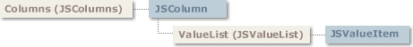

# JSColumns Collection

## JSColumns Collection

  
 Contains a collection of **JSColumn** objects.

### Syntax

 *gridex*.**Columns**  
 The *gridex* placeholder represents an object expression that evaluates to a **GridEX** control.

### Remarks

 Using the **JSColumns** collection you can add and remove **JSColumn** objects, count or enumerate **JSColumn** objects, and access individual **JSColumn** objects.  
 To access a specific column in the collection you can use the **Item** property of this collection or the **ItemByPosition** method.

- [JSColumn Object](JSColumn-Object.md#jscolumn-object)
- [JSValueList Collection](JSValueList-Collection.md#jsvaluelist-collection)
- [JSValueItem Object](JSValueItem-Object.md#jsvalueitem-object)

**See Also:** [JSColumn Object](JSColumn-Object.md#jscolumn-object), [Item Property](#item-property-jscolumns-collection), [ItemByPosition Method](#itembyposition-method-jscolumns-collection), [Columns Property](../Properties.md#columns-property-gridex-control)

## Count Property (JSColumns Collection)

Returns the number of objects in a collection.

### Syntax

 *object*.**Count**  
 The object placeholder is an object expression that evaluates to an object in the Applies To list.

### Remarks

 You can use this property with a **For...Next** statement to carry out operations on objects in a collection.  
 For example, the following code sets **ColPosition** property of all columns to its original index.

```vb
For I = 1 To GridEX1.Columns.Count
GridEX1.Columns(I).ColPosition = I
Next I
```

### Data Type

 Integer

**Note** Since collections are 1-based, there is no need to use the *Collections.Count-1*counter expression in **For…Next** loops.

**Applies To:** [JSColumns Collection](#jscolumns-collection)  
**See Also:** [Item Property](#item-property-jscolumns-collection), [Index Property](JSColumn-Object.md#index-property-jscolumn-object)

## Item Property (JSColumns Collection)

Returns a specific **JSColumn** of the collection, either by index or by key.

### Syntax

 *object*.**Item(***index***)**  
 The Item property syntax has the following parts:

| Part | Description |
| --- | --- |
| *object* | Required. An object expression that evaluates to an object in the Applies To list. |
| *index* | Required. An expression that specifies the index of a column in the columns collection.<br> <br> If a numeric expression, *index* must be a number from 1 to the value of the **Count** property. <br> <br> If a string expression, *index* must correspond to the **Key** property of the column. |

### Remarks

 If the value provided as index does not match any existing member of the collection, an error occurs.  
 **Item** is the default property for a collection. Therefore, the following lines of code are equivalent:

```vb
Debug.Print GridEX1.Columns(1).Caption

Debug.Print GridEX1.Columns.Item(1).Caption
```

### Data Type

 **JSColumn**

**Applies To:** [JSColumns Collection](#jscolumns-collection)  
**See Also:** [Count Property](#count-property-jscolumns-collection), [Remove Method](#remove-method-jscolumns-collection), [ItemByPosition Method](#itembyposition-method-jscolumns-collection), [Index Property](JSColumn-Object.md#index-property-jscolumn-object), [Key Property](JSColumn-Object.md#key-property-jscolumn-object)  
**Example:** [Columns Example](../../Examples.md#columns-example)

## Add Method (JSColumns Collection)

Adds a **JSColumn** object to the collection and returns a reference to the newly created object.

### Syntax

 *object*.**Add** *caption, columntype, edittype, key*  
 The **Add** method syntax has these parts:

| Part | Description |
| --- | --- |
| *object* | Required. An object expression that evaluates to an object in the Applies To list. |
| *caption* | Optional. A string expression specifying the **Caption** for the **JSColumn** object. |
| *columntype* | Optional. A value or constant specifying the **ColumnType** for the **JSColumn** object. The available column types are detailed in the **ColumnType** property (**JSColumn** object).The default value for this parameter is text-type (**ColumnType** = **jgexText**) |
| *edittype* | Optional. A value or constant specifying the **EditType** for the **JSColumn** object. The available edit types are detailed in the **EditType** property (**JSColumn** object). The default value for this parameter is textbox-type (**EditType** = **jgexEditTextBox**) |
| *key* | Optional. A unique string that identifies the **JSColumn** object. Use this value to retrieve a specific **JSColumn** object. |

### Remarks

 You can add **JSColumn** objects at design time using the Columns tab of the Property Page of the **GridEX** control. At run time, use the **Add** method to add **JSColumn** objects as in the following code:

```vb
Dim colColumn as JSColumn
Set colColumn = GridEX1.Columns.Add("name", ,jgexEditNone, "name")
```

### Data Type

 **JSColumn**

**Applies To:** [JSColumns Collection](#jscolumns-collection)  
**See Also:** [Caption Property](JSColumn-Object.md#caption-property-jscolumn-object), [ColumnType Property](JSColumn-Object.md#columntype-property-jscolumn-object), [EditType Property](JSColumn-Object.md#edittype-property-jscolumn-object), [Key Property](JSColumn-Object.md#key-property-jscolumn-object), [JSColumn Object](JSColumn-Object.md#jscolumn-object)  
**Example:** [ColumnAdd Example](../../Examples.md#columnadd-example)

## Clear Method (JSColumns Collection)

Removes all objects in a collection.

### Syntax

 *object*.**Clear**  
 The object placeholder represents an object expression that evaluates to an object in the Applies To list.

### Remarks

 To remove only one object from a collection, use the **Remove** method of the collection.

**Applies To:** [JSColumns Collection](#jscolumns-collection)  
**See Also:** [Remove Method](#remove-method-jscolumns-collection)

## ItemByPosition Method (JSColumns Collection)

Returns a specific **JSColumn** based on its position.

### Syntax

 *object*.**ItemByPosition(***position***)**  
 The **ItemByPosition** property syntax has these parts:

| Part | Description |
| --- | --- |
| *object* | Required.An object expression that evaluates to an object in the Applies To list. |
| *position* | Required. An expression that specifies the position of a column. |

### Remarks

 When a column changes its position the **Index** property for that column remains the same and only its **ColPosition** property changes.  
 For that reason, regardless of how many times a column is moved, it always appears in the same position of the collection. However, there are times when you need to access a column by its positional index, rather than its collection index. In those cases you need to use this method instead of the **Item** property.  
 For example, when you access the current column in a **GridEX** control through the **Col** property, the value represents the position of the column. If you need to access the **JSColumn** object that represents the current column, you need to get it through the **ItemByPosition** property as follows:

```vb
Dim colColumn as JSColumn
If GridEX1.Col > 0 then
Set colColumn = GridEX1.Columns.ItemByPosition(GridEX1.Col)
Debug.Print colColumn.Caption
End if
```

### Data Type

 **JSColumn**

**Applies To:** [JSColumns Collection](#jscolumns-collection)  
**See Also:** [ColPosition Property](JSColumn-Object.md#colposition-property-jscolumn-object), [Index Property](JSColumn-Object.md#index-property-jscolumn-object), [Item Property](#item-property-jscolumns-collection)  
**Example:** [Columns Example](../../Examples.md#columns-example)

## Remove Method (JSColumns Collection)

Removes a specific member from the **JSColumns** collection.

### Syntax

 *object*.**Remove** *index*  
 The **Remove** method syntax has these parts:

| Part | Description |
| --- | --- |
| *object* | An object expression that evaluates to an object in the Applies To list. |
| *index* | An integer or string that uniquely identifies the column within the collection.<br> <br> Use an integer to specify the value of the **Index** property; use a string to specify the value of the **Key** property. |

### Remarks

 To remove all the members of a collection, use the **Clear** method.

**Applies To:** [JSColumns Collection](#jscolumns-collection)  
**See Also:** [Item Property](#item-property-jscolumns-collection), [Index Property](JSColumn-Object.md#index-property-jscolumn-object), [Clear Method](#clear-method-jscolumns-collection), [Key Property](JSColumn-Object.md#key-property-jscolumn-object)
