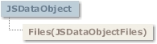

# JSDataObject Object

## JSDataObject Object

  
 The **JSDataObject** object is a container for data being transferred from a component source to a component target.  
 The data is stored in the format defined by the method using the **JSDataObject** object.

### Syntax

 **JSDataObject**  
 The *gridex* placeholder represents an object expression that evaluates to a **GridEX** control.

### Remarks

 The **JSDataObject** allows OLE drag and drop and clipboard operations to be implemented from within the **GridEx** control.  
 **GridEX** control supports only manual OLE drag and drop events.

- [JSDataObjectFiles Collection](JSDataObjectFiles-Collection.md#jsdataobjectfiles-collection)

**See Also:** [JSDataObjectFiles Collection](JSDataObjectFiles-Collection.md#jsdataobjectfiles-collection), [OLEDragDrop Event](../Events.md#oledragdrop-event-gridex-control), [OLEDragOver Event](../Events.md#oledragover-event-gridex-control), [OLESetData Event](../Events.md#olesetdata-event-gridex-control), [OLEStartDrag Event](../Events.md#olestartdrag-event-gridex-control)

## Files Property (JSDataObject Object)

Returns a **JSDataObjectFiles** collection, which in turn contains a list of all filenames used by a **JSDataObject** object (such as the names of files that a user drags to or from the Windows File Explorer.)

### Syntax

 *object*.**Files**(*index*)  
 The **Files** property syntax has these parts:

| Part | Description |
| --- | --- |
| *object* | An object expression that evaluates to an object in the Applies To list. |
| *index* | An integer which is an index to an array of filenames. |

### Remarks

 The **Files** collection is filled with filenames only when the **JSDataObject** object contains data of type **jgexCFFiles**. (The **JSDataObject** object can contain several different types of data.) You can iterate through the collection to retrieve the list of file names.  
 The **Files** collection can be filled to allow applications to act as a drag source for a list of files.

### Data Type

 **JSDataObjectFiles**

**Applies To:** [JSDataObject Object](#jsdataobject-object)  
**See Also:** [JSDataObjectFiles Collection](JSDataObjectFiles-Collection.md#jsdataobjectfiles-collection)

## Clear Method (JSDataObject Object)

Removes all objects in a collection.

### Syntax

 *object*.**Clear**  
 The object placeholder represents an object expression that evaluates to an object in the Applies To list.

### Remarks

 To remove only one object from a collection, use the **Remove** method of the collection.

**Applies To:** [JSDataObject Object](#jsdataobject-object)  
**See Also:** [Clear Method](JSDataObjectFiles-Collection.md#clear-method-jsdataobjectfiles-collection)

## GetData Method (JSDataObject Object)

Returns data from a **JSDataObject** object in the form of a variant.

### Syntax

 *object*.**GetData** **(***format* **As Integer)**  
 The **GetData** method syntax has these parts:

| Part | Description |
| --- | --- |
| object | An object expression that evaluates to an object in the Applies To list. |
| format | A constant or value that specifies the data format, as described in Settings.   If format is 0, **GetData** automatically uses the appropriate format. |

### Settings

 The settings for format are:

| Constant | Value | Description |
| --- | --- | --- |
|  **jgexCFText** | 1 | Text. |
|  **jgexCFBitmap** | 2 | Bitmap. |
|  **jgexCFMetafile** | 3 | Metafile. |
|  **jgexCFEMetafile** | 14 | Enhanced metafile. |
|  **jgexCFDIB** | 8 | Device-independent bitmap. |
|  **jgexCFPalette** | 9 | Color palette. |
|  **jgexCFFiles** | 15 | List of files. |
|  **jgexCFRTF** | -16639 | Rich text format. |

### Remarks

 It's possible for the **GetData** and **SetData** methods to use data formats other than those listed in Settings, including user-defined formats registered with Windows via the RegisterClipboardFormat() API function. However, there are a few caveats:  
 The **SetData** method requires the data to be in the form of a byte array when it does not recognize the data format specified.  
 The **GetData** method always returns data in a byte array when it is in a format that it doesn't recognize.The byte array returned by **GetData** will be larger than the actual data when running on some operating systems, with arbitrary bytes at the end of the array. The reason for this is that Visual Basic does not know the data's format, and knows only the amount of memory that the operating system has allocated for the data. This allocation of memory is often larger than is actually required for the data. Therefore, there may be extraneous bytes near the end of the allocated memory segment. As a result, you must use appropriate functions to interpret the returned data in a meaningful way.

### Data Type

 Variant

**Applies To:** [JSDataObject Object](#jsdataobject-object)  
**See Also:** [SetData Method](#setdata-method-jsdataobject-object), [GetFormat Method](#getformat-method-jsdataobject-object)

## GetFormat Method (JSDataObject Object)

Returns a value indicating whether an item in the **JSDataObject** object matches a specified format.

### Syntax

 *object*.**GetFormat (***format* **As Integer)**  
 The **GetFormat** method syntax has these parts:

| Part | Description |
| --- | --- |
| object | An object expression that evaluates to an object in the Applies To list. |
| format | A constant or value that specifies the data format, as described in Settings. |

### Remarks

 The **GetFormat** method returns **True** if an item in the **JSDataObject** object matches the specified format. Otherwise, it returns **False**.

### Settings

 The settings for format are:

| Constant | Value | Description |
| --- | --- | --- |
|  **jgexCFText** | 1 | Text. |
|  **jgexCFBitmap** | 2 | Bitmap. |
|  **jgexCFMetafile** | 3 | Metafile. |
|  **jgexCFEMetafile** | 14 | Enhanced metafile. |
|  **jgexCFDIB** | 8 | Device-independent bitmap. |
|  **jgexCFPalette** | 9 | Color palette. |
|  **jgexCFFiles** | 15 | List of files. |
|  **jgexCFRTF** | -16639 | Rich text format. |

### Data Type

 Boolean

**Applies To:** [JSDataObject Object](#jsdataobject-object)  
**See Also:** [SetData Method](#setdata-method-jsdataobject-object), [GetData Method](#getdata-method-jsdataobject-object)

## SetData Method (JSDataObject Object)

Inserts data into a **JSDataObject** object using the specified data format.

### Syntax

 *object*.**SetData (***value* **As Variant**, *format* **As Integer)**  
 The **SetData** method syntax has these parts:

| Part | Description |
| --- | --- |
| *object* | An object expression that evaluates to an object in the Applies To list. |
| *value* | Optional. A variant containing the data to be passed to the **JSDataObject** object. |
| *format* | Optional. A constant or value that specifies the data format, as described in Settings. |

### Settings

 The settings for *format* are:

| Constant | Value | Description |
| --- | --- | --- |
|  **jgexCFText** | 1 | Text |
|  **jgexCFBitmap** | 2 | Bitmap |
|  **jgexCFMetafile** | 3 | Metafile |
|  **jgexCFEMetafile** | 14 | Enhanced metafile |
|  **jgexCFDIB** | 8 | Device-independent bitmap |
|  **jgexCFPalette** | 9 | Color palette |
|  **jgexCFFiles** | 15 | List of files |
|  **jgexCFRTF** | -16639 | Rich text format |

### Remarks

 The value argument is optional. This allows you to set several different formats that the source component can support without having to load the data separately for each format. Multiple formats are set by calling **SetData** several times, each time using a different format. If you wish to start fresh, use the **Clear** method to clear all data and format information from the **JSDataObject**.  
 The format argument is also optional, but either the data or format argument must be specified. When the target requests the data, and a format was specified, but no data was provided, the **OLESetData** event occurs, and the source can then provide the requested data type.  
 It's possible for the **GetData** and **SetData** methods to use data formats other than those listed in Settings, including user-defined formats registered with Windows via the RegisterClipboardFormat() API function. However, there are a few caveats:  
 The **SetData** method requires the data to be in the form of a byte array when it does not recognize the data format specified.

### Data Type

 Variant

**Applies To:** [JSDataObject Object](#jsdataobject-object)  
**See Also:** [GetData Method](#getdata-method-jsdataobject-object), [GetFormat Method](#getformat-method-jsdataobject-object)  
**Example:** [RowDrag Example](../../Examples.md#rowdrag-example)
