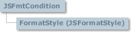

# JSFmtCondition Object

## JSFmtCondition Object

  
 Represents the criteria that rows must meet to apply a different format in them.

### Syntax

 *gridex*.**FmtConditions** ( *index* )  
 The **JSFmtCondition** object syntax has these parts:

| Part | Description |
| --- | --- |
| *gridex* | An object expression that evaluates to a **GridEX** control. |
| *index* | An integer that represents the value of the **Index** property. |

### Remarks

 With a **JSFmtCondition** object, you can have special formatting settings for rows that meet certain criteria.  
 To use a **JSFmtCondition** object, you can use the **FmtConditions** property of the **GridEX** control. You can also assign a **JSFmtCondition** to a separate variable dimensioned as **JSFmtCondition**. The following shows both ways:

```vb
Dim ftcTemp as JSFmtCondition

Set ftcTemp = GridEX1.FmtConditions(1)
Debug.Print ( ftcTemp Is GridEX1.FmtConditions(1))

'Prints True
```

- [JSFormatStyle Object](JSFormatStyle-Object.md#jsformatstyle-object)

**See Also:** [JSFmtConditions Collection](JSFmtConditions-Collection.md#jsfmtconditions-collection), [Item Property](JSFmtConditions-Collection.md#item-property-jsfmtconditions-collection), [GroupCondition Property](JSFmtConditions-Collection.md#groupcondition-property-jsfmtconditions-collection), [FmtConditions Property](../Properties.md#fmtconditions-property-gridex-control)

## ColIndex Property (JSFmtCondition Object)

Returns or sets the index of the column referenced by an object.

### Syntax

 *object*.**ColIndex** [ = *value*]  
 The **ColIndex** property syntax has these parts:

| Part | Description |
| --- | --- |
| *object* | An object expression that evaluates to an object in the Applies To list. |
| *value* | An integer that refers to the index of the column to which the object is attached. |

**Remarks**:  
 If you set the **ColIndex** property to a value that does not represent a **JSColumn** in the **JSColumns** collection, an error occurs.  
 Changing the **ColIndex** property, in a **JSGroup** or **JSSortKey** object, forces the recalculation of group rows and/or sort positions for all records.

### Data Type

 Integer

**Applies To:** [JSFmtCondition Object](#jsfmtcondition-object)  
**See Also:** [Index Property](JSColumn-Object.md#index-property-jscolumn-object), [JSColumn Object](JSColumn-Object.md#jscolumn-object)

## FormatStyle Property (JSFmtCondition Object)

Returns the **JSFormatStyle** object attached to a **JSFmtCondition** object.

### Syntax

 *object*.**FormatStyle**  
 The object placeholder represents an object in the Applies To list.

### Remarks

 Each **JSFmtCondition** object has a **JSFormatStyle** object that contains format settings for rows that meet the criteria specified in the object.

### Data Type

 **JSFormatStyle**

**Applies To:** [JSFmtCondition Object](#jsfmtcondition-object)  
**See Also:** [JSFormatStyle Object](JSFormatStyle-Object.md#jsformatstyle-object), [JSFormatStyles Collection](JSFormatStyles-Collection.md#jsformatstyles-collection)  
**Example:** [FmtConditions Example](../../Examples.md#fmtconditions-example)

## Index Property (JSFmtCondition Object)

Returns a value that represents the index of an object in a collection. Read only.

### Syntax

 *object*.**Index**  
 The object placeholder represents an object expression that evaluates to an object in the Applies To list.

### Remarks

 The Index property for all collections is 1-based.

### Data Type

 Integer

**Applies To:** [JSFmtCondition Object](#jsfmtcondition-object)  
**See Also:** [Count Property](JSFmtConditions-Collection.md#count-property-jsfmtconditions-collection), [Item Property](JSFmtConditions-Collection.md#item-property-jsfmtconditions-collection), [Remove Method](JSFmtConditions-Collection.md#remove-method-jsfmtconditions-collection)

## Key Property (JSFmtCondition Object)

Returns or sets a string that uniquely identifies a member in a collection.

### Syntax

 *object*.**Key** [ = *string* ]  
 The **Key** property syntax has these parts:

| Part | Description |
| --- | --- |
| *object* | An object expression that evaluates to an object in the Applies To list. |
| string | A unique string identifying a member in a collection. |

### Remarks

 If the string is not unique within the collection, an error will occur.  
 You can set the **Key** property when you use the **Add** method to add an object to a collection.

### Data Type

 String

**Applies To:** [JSFmtCondition Object](#jsfmtcondition-object)  
**See Also:** [Add Method](JSFmtConditions-Collection.md#add-method-jsfmtconditions-collection), [Remove Method](JSFmtConditions-Collection.md#remove-method-jsfmtconditions-collection), [Item Property](JSFmtConditions-Collection.md#item-property-jsfmtconditions-collection), [Index Property](#index-property-jsfmtcondition-object)

## Operator Property (JSFmtCondition Object)

Returns or sets the operator used for comparison in a **JSFmtCondition** object.

### Syntax

 *object*.**Operator** [ = *value*]  
 The **Operator** property syntax has these parts:

| Part | Description |
| --- | --- |
| *object* | An object expression that evaluates to an object in the Applies To list. |
| *value* | A value or constants that represents the operator used for comparison as described in settings. |

### Settings

 The settings for *value* are:

| Constant | Value | Description |
| --- | --- | --- |
|  **jgexEqual** | 0 | Applies **JSFormatStyle** properties to all records where the value of the column attached is equal to the **Value1** property. |
|  **jgexNotEqual** | 1 | Applies **JSFormatStyle** properties to all records where the value of the column attached is different to the **Value1** property. |
|  **jgexGreaterThan** | 2 | Applies **JSFormatStyle** properties to all records where the value of the column attached is greater than the **Value1** property. |
|  **jgexLessThan** | 3 | Applies **JSFormatStyle** properties to all records where the value of the column attached is less than the **Value1** property. |
|  **jgexGreaterThanOrEqualTo** | 4 | Applies **JSFormatStyle** properties to all records where the value of the column attached is greater than or equal to the **Value1** property. |
|  **jgexLessThanOrEqualTo** | 5 | Applies **JSFormatStyle** properties to all records where the value of the column attached is less than or equal to the **Value1** property. |
|  **jgexBetween** | 6 | Applies **JSFormatStyle** properties to all records where the value of the column attached is greater than or equal to the **Value1** property and less than or equal to **Value2** property. |
|  **jgexNotBetween** | 7 | Applies **JSFormatStyle** properties to all records where the value of the column attached is less than the **Value1** property and greater than **Value2** property. |
|  **jgexContains** | 8 | Applies **JSFormatStyle** properties to all records where the value of the column attached contains **Value1** property. |
|  **jgexNotContains** | 9 | Applies **JSFormatStyle** properties to all records where the value of the column attached does not contain **Value1** property. |

### Data Type

 **jgexConditionOperatorConstants**

**Applies To:** [JSFmtCondition Object](#jsfmtcondition-object)  
**See Also:** [SetCondition Method](#setcondition-method-jsfmtcondition-object), [Add Method](JSFmtConditions-Collection.md#add-method-jsfmtconditions-collection)

## Value1 Property (JSFmtCondition Object)

Returns or sets the values that are compared with column values.

### Syntax

 *object*.**Value1** [ = *value*]  
 The **Value1** property syntax has these parts:

| Part | Description |
| --- | --- |
| *object* | An object expression that evaluates to an object in the Applies To list. |
| *value* | A variant expression that represents the value used for comparisons with the attached column values. |

### Remarks

 You must use the **Value2** property setting for between and not between comparisons.

### Data Type

 Variant

**Applies To:** [JSFmtCondition Object](#jsfmtcondition-object)  
**See Also:** [Add Method](JSFmtConditions-Collection.md#add-method-jsfmtconditions-collection), [SetCondition Method](#setcondition-method-jsfmtcondition-object), [Value2 Property](#value2-property-jsfmtcondition-object)

## Value2 Property (JSFmtCondition Object)

Returns or sets the values that are compared with column values.

### Syntax

 *object*.**Value2** [ = *value*]  
 The **Value2** property syntax has these parts:

| Part | Description |
| --- | --- |
| *object* | An object expression that evaluates to an object in the Applies To list. |
| *value* | A variant expression that represents the value used for comparisons with the attached column values. |

### Remarks

 The **Value2** property setting is used only for between and not between comparisons.

### Data Type

 Variant

**Applies To:** [JSFmtCondition Object](#jsfmtcondition-object)  
**See Also:** [Add Method](JSFmtConditions-Collection.md#add-method-jsfmtconditions-collection), [SetCondition Method](#setcondition-method-jsfmtcondition-object), [Value1 Property](#value1-property-jsfmtcondition-object)

## SetCondition Method (JSFmtCondition Object)

Sets the condition parameters for a **JSFmtCondition** object.

### Syntax

 *object*.**SetCondition** *colindex, operator, value1, value2*  
 The **SetCondition** method syntax has these parts:

| Part | Description |
| --- | --- |
| *object* | An object expression that evaluates to an object in the Applies To list. |
| *colindex* | Required. An integer expression that represents the index of the column, whose values are to be used in the comparison operation. |
| *operator* | Required. A value or constant that specifies the operator used in the comparison operation. The available operators are detailed in the Operator property |
| *value1* | Required. A variant that represents the value that is to be compared with the column values. |
| *value2* | Optional. A variant that represents the value that is to be compared with the column values. |

**Applies To:** [JSFmtCondition Object](#jsfmtcondition-object)  
**See Also:** [Add Method](JSFmtConditions-Collection.md#add-method-jsfmtconditions-collection), [ColIndex Property](#colindex-property-jsfmtcondition-object), [Operator Property](#operator-property-jsfmtcondition-object), [Value1 Property](#value1-property-jsfmtcondition-object), [Value2 Property](#value2-property-jsfmtcondition-object)  
**Example:** [FmtConditions Example](../../Examples.md#fmtconditions-example)
