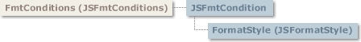

# JSFmtConditions Collection

## JSFmtConditions Collection

  
 Contains a collection of **JSFmtCondition** objects.

### Syntax

 *gridex*.**FmtConditions**  
 The *gridex* placeholder represents an object expression that evaluates to a **GridEX** control.

### Remarks

 With the **JSFmtConditions** collection you can add and remove **JSFmtCondition** objects, count the number of **JSFmtCondition** objects, and address individual **JSFmtCondition** objects.  
 The **JSFmtConditions** collection can be accessed through the **FmtConditions** property of the **GridEX** control.  
 To get a specific **JSFmtCondition** object in the collection you can use the **Item** property or the **GroupCondition** property.

- [JSFmtCondition Object](JSFmtCondition-Object.md#jsfmtcondition-object)
- [JSFormatStyle Object](JSFormatStyle-Object.md#jsformatstyle-object)

**See Also:** [JSFmtCondition Object](JSFmtCondition-Object.md#jsfmtcondition-object), [Item Property](#item-property-jsfmtconditions-collection), [GroupCondition Property](#groupcondition-property-jsfmtconditions-collection), [FmtConditions Property](../Properties.md#fmtconditions-property-gridex-control)

## ApplyGroupCondition Property (JSFmtConditions Collection)

Controls whether the **GroupCondition** property will be valid for a **JSFmtConditions** collection.

### Syntax

 *object*.**ApplyGroupCondition** [ = *value*]  
 The **ApplyGroupCondition** property syntax has these parts:

| Part | Description |
| --- | --- |
| *object* | An object expression that evaluates to an object in the Applies To list. |
| *value* | A Boolean expression that controls whether the **GroupCondition** property will be valid for a **JSFmtConditions** collection as described in settings. |

### Settings

 The settings for value are:

| Setting | Description |
| --- | --- |
| **True** | The **GroupCondition** property is valid and it will be applied whenever a **GridEX** control is grouped. |
| **False** | (Default) No conditional formatting is applied in the group rows. |

**Remarks**:  
 When you need to highlight records that meet certain criteria and expand that highlight through the groups, you must use the **GroupCondition** property.  
 You must set the **ApplyGroupCondition** property to **True**, to be able to use the **GroupCondition** property.

### Data Type

 Boolean

**Applies To:** [JSFmtConditions Collection](#jsfmtconditions-collection)  
**See Also:** [GroupCondition Property](#groupcondition-property-jsfmtconditions-collection), [GroupConditionCountTitle Property](#groupconditioncounttitle-property-jsfmtconditions-collection), [ShowGroupConditionCount Property (JSFmtConditions Collection](#showgroupconditioncount-property-jsfmtconditions-collection)  
**Example:** [FmtConditions Example](../../Examples.md#fmtconditions-example)

## Count Property (JSFmtConditions Collection)

Returns the number of objects in a collection.

### Syntax

 *object*.**Count**  
 The object placeholder is an object expression that evaluates to an object in the Applies To list.

### Remarks

 You can use this property with a **For...Next** statement to carry out operations on objects in a collection.

### Data Type

 Long

**Note** Since collections are 1-based, there is no need to use the *Collections.Count-1*counter expression in **For…Next** loops.

**Applies To:** [JSFmtConditions Collection](#jsfmtconditions-collection)  
**See Also:** [Item Property](#item-property-jsfmtconditions-collection), [Index Property](JSFmtCondition-Object.md#index-property-jsfmtcondition-object)

## GroupCondition Property (JSFmtConditions Collection)

Returns a **JSFmtCondition** object that is applied in the group rows in a **GridEX** control.

### Syntax

 *object*.**GroupCondition**  
 The object placeholder represents an object in the Applies To list.

### Remarks

 The **GroupCondition** property returns a **JSFmtCondition** object that applies to the group rows when one or more records in the group meet the criteria specified by the **JSFmtCondition**’s properties.  
 The **FormatStyle** properties are applied only to the group rows. If you want to apply it to all the rows, you must add a **JSFmtCondition** to the **JSFmtConditions** collection with the same property settings.

### Data Type

 **JSFmtCondition**

**Applies To:** [JSFmtConditions Collection](#jsfmtconditions-collection)  
**See Also:** [GroupConditionCountTitle Property](#groupconditioncounttitle-property-jsfmtconditions-collection), [ShowGroupConditionCount Property (JSFmtConditions Collection](#showgroupconditioncount-property-jsfmtconditions-collection), [ApplyGroupCondition Property](#applygroupcondition-property-jsfmtconditions-collection)  
**Example:** [FmtConditions Example](../../Examples.md#fmtconditions-example)

## GroupConditionCountTitle Property (JSFmtConditions Collection)

Returns or sets the text displayed in a group row when one or more rows in the group meet the criteria specified in the properties of the **GroupCondition** object.

### Syntax

 *object*.**GroupConditionCountTitle** [ = *value*]  
 The GroupConditionCountTitle property syntax has these parts:

| Part | Description |
| --- | --- |
| *object* | An object expression that evaluates to an object in the Applies To list. |
| *value* | A string expression that represents the text displayed with count of rows that meet the criteria specified in the **GroupCondition** property settings. The default value is “items” |

### Remarks

 Whenever a group row has records that meet the criteria specified in the **GroupCondition** property settings, the group row is displayed with the **GroupCondition**’s **FormatStyle** property settings.  
 If the **ShowGroupConditionCount** is set to **True**, the group row will display the count of rows that meet the criteria followed by the **GroupConditionCountTitle** property setting and enclosed by parenthesis.  
 This property has no use if the **ApplyGroupCondition** or **ShowGroupConditionCount** properties are set to **False**.

### Data Type

 String

**Applies To:** [JSFmtConditions Collection](#jsfmtconditions-collection)  
**See Also:** [GroupCondition Property](#groupcondition-property-jsfmtconditions-collection), [ShowGroupConditionCount Property (JSFmtConditions Collection](#showgroupconditioncount-property-jsfmtconditions-collection), [ApplyGroupCondition Property](#applygroupcondition-property-jsfmtconditions-collection)  
**Example:** [FmtConditions Example](../../Examples.md#fmtconditions-example)

## Item Property (JSFmtConditions Collection)

Returns a specific **JSFmtCondition** of the **JSFmtConditions** collection either by index or by key.

### Syntax

 *object*.**Item(***index***)**  
 The **Item** property syntax has the following parts:

| Part | Description |
| --- | --- |
| *object* | Required. An object expression that evaluates to an object in the Applies To list. |
| *index* | Required. An expression that specifies the position of a member of the collection.<br> <br> If a numeric expression, *index* must be a number from 1 to the value of the **Count** property. <br> <br> If a string expression, *index* must correspond to the **Key** property of the member. |

### Remarks

 If the value provided as index does not match any existing member of the collection, an error occurs.  
 **Item** is the default property for a collection. Therefore, the following lines of code are equivalent:

```vb
Debug.Print GridEX1.FmtConditions(1).ColIndex

Debug.Print GridEX1.FmtConditions.Item(1).ColIndex
```

### Data Type

 **JSFmtCondition**

**Applies To:** [JSFmtConditions Collection](#jsfmtconditions-collection)  
**See Also:** [Count Property](#count-property-jsfmtconditions-collection), [Remove Method](#remove-method-jsfmtconditions-collection), [Index Property](JSFmtCondition-Object.md#index-property-jsfmtcondition-object), [Key Property](JSFmtCondition-Object.md#key-property-jsfmtcondition-object)

## ShowGroupConditionCount Property (JSFmtConditions Collection

Controls whether the count of rows, that meet the criteria specified in **GroupCondition** property settings, will be displayed in a group row.

### Syntax

 *object*.**ShowGroupConditionCount** [ = *value* ]  
 The **ShowGroupConditionCount** property syntax has these parts:

| Part | Description |
| --- | --- |
| *object* | An object expression that evaluates to an object in the Applies To list. |
| *value* | A Boolean expression that controls whether the count of rows, that meet criteria in **GroupCondition** property settings, is displayed in the group row as described in settings. |

### Settings

 The settings for *value* are:

| Setting | Description |
| --- | --- |
| **True** | (Default) The group row displays the row count. |
| **False** | The group row does not display the row count. |

### Data Type

 Boolean

**Applies To:** [JSFmtConditions Collection](#jsfmtconditions-collection)  
**See Also:** [GroupCondition Property](#groupcondition-property-jsfmtconditions-collection), [GroupConditionCountTitle Property](#groupconditioncounttitle-property-jsfmtconditions-collection), [ApplyGroupCondition Property](#applygroupcondition-property-jsfmtconditions-collection)  
**Example:** [FmtConditions Example](../../Examples.md#fmtconditions-example)

## Add Method (JSFmtConditions Collection)

Adds a **JSFmtCondition** object to the collection and returns a reference to the newly created object.

### Syntax

 *object*.**Add** *colindex, operator, value1, value2, key*  
 The **Add** method syntax has these parts:

| Part | Description |
| --- | --- |
| *object* | Required. An object expression that evaluates to an object in the Applies To list. |
| *colindex* | Required. An integer that represents the Index of the **JSColumn** object to attach to the **JSFmtCondition**. |
| *operator* | Optional. A value or constant specifying the **Operator** property for the **JSFmtCondition** object. The available operators are detailed in the **Operator** property (**JSFmtCondition** object).The default value for this parameter is equal operator (**Operator** = **jgexEqual**) |
| *value1* | Optional. A variant that represents the value to be compared with the column values. |
| *value2* | Optional. A variant that represents the value to be compared with the column values. |
| *Key* | Optional. A unique string that identifies the **JSFmtCondition** object. Use this value to retrieve a specific **JSFmtCondition** object. |

### Remarks

 JSFmtCondition objects can be added only at run time. Use the **Add** method to add **JSFmtCondition** objects as in the following code:

```vb
Dim fmcCondition as JSFmtCondition
Set fmcCondition = GridEX1.FmtConditions.Add(1, jgexEqual, "")
```

### Data Type

 **JSFmtCondition**

**Applies To:** [JSFmtConditions Collection](#jsfmtconditions-collection)  
**See Also:** [ColIndex Property](JSFmtCondition-Object.md#colindex-property-jsfmtcondition-object), [JSFmtCondition Object](JSFmtCondition-Object.md#jsfmtcondition-object), [Key Property](JSFmtCondition-Object.md#key-property-jsfmtcondition-object), [Operator Property](JSFmtCondition-Object.md#operator-property-jsfmtcondition-object), [Value1 Property](JSFmtCondition-Object.md#value1-property-jsfmtcondition-object), [Value2 Property](JSFmtCondition-Object.md#value2-property-jsfmtcondition-object)  
**Example:** [FmtConditions Example](../../Examples.md#fmtconditions-example)

## Clear Method (JSFmtConditions Collection)

Removes all objects in a collection.

### Syntax

 *object*.**Clear**  
 The object placeholder represents an object expression that evaluates to an object in the Applies To list.

### Remarks

 To remove only one object from a collection, use the **Remove** method of the collection.

**Applies To:** [JSFmtConditions Collection](#jsfmtconditions-collection)  
**See Also:** [Remove Method](#remove-method-jsfmtconditions-collection)

## Remove Method (JSFmtConditions Collection)

Removes a specific member from the **JSFmtConditions** collection.

### Syntax

 *object*.**Remove** *index*  
 The **Remove** method syntax has these parts:

| Part | Description |
| --- | --- |
| *object* | An object expression that evaluates to an object in the Applies To list. |
| *index* | An integer or string that uniquely identifies the **JSFmtCondition** within the collection. <br> <br> Use an integer to specify the value of the **Index** property; use a string to specify the value of the **Key** property. |

### Remarks

 To remove all the members of a collection, use the **Clear** method instead.

**Applies To:** [JSFmtConditions Collection](#jsfmtconditions-collection)  
**See Also:** [Item Property](#item-property-jsfmtconditions-collection), [Index Property](JSFmtCondition-Object.md#index-property-jsfmtcondition-object), [Clear Method](#clear-method-jsfmtconditions-collection), [Key Property](JSFmtCondition-Object.md#key-property-jsfmtcondition-object)
