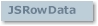

# JSRowData Object

## JSRowData Object

  
 The **JSRowData** object is a container for data and row and cell based formats.

### Syntax

 **JSRowData**

### Remarks

 In an unbound **GridEX** control, the **JSRowData** object is used in order to supply row data in the **UnboundReadData** event or to obtain the row data to be updated or added in the **UnboundUpdate** and **UnboundAddNew** events.  
 The **JSRowData** object is also used to change row and cell formats in the **RowFormat** event or when it is retrieved using the **GetRowData** method.  
 A **JSRowData** object may become outdated as the result of scrolling or refreshing the **GridEX** contents. When you try to change some of the properties of an outdated **JSRowData** an error occurs. To avoid working with outdated **JSRowData** objects try not to save them between procedures.

**See Also:** [UnboundReadData Event](../Events.md#unboundreaddata-event-gridex-control), [UnboundUpdate Event](../Events.md#unboundupdate-event-gridex-control), [UnboundAddNew Event](../Events.md#unboundaddnew-event-gridex-control), [RowFormat Event](../Events.md#rowformat-event-gridex-control), [GetRowData Method](../Methods.md#getrowdata-method-gridex-control)

## Bookmark Property (JSRowData Object)

Returns a value containing the bookmark of a **JSRowData** in a **GridEX** control. Read-only

### Syntax

 *object*.**Bookmark**  
 The object placeholder represents an object expression that evaluates to an object in the Applies To list.

### Remarks

 The **Bookmark** property returns the bookmark of a **JSRowData** object.  
 If the **JSRowData** represents a group header row or a group footer row the **Bookmark** property returns Null.

### Data Type

 Variant

**Applies To:** [JSRowData Object](#jsrowdata-object)  
**See Also:** [RowBookmark Property](../Properties.md#rowbookmark-property-gridex-control)

## CellPicture Property (JSRowData Object)

Returns or sets the foreground picture to be displayed in a cell.

### Syntax

 *object*.**CellPicture** **(***colindex***)** [ = *picture* ]  
 The **CellPicture** property syntax has these parts:

| Part | Description |
| --- | --- |
| *object* | An object expression that evaluates to an object in the Applies To list. |
| *colindex* | An integer that represent the index of a column. |
| *picture* | A Picture object containing an icon or bitmap to be displayed in a cell. |

### Remarks

 Use this property to have pictures in cells without using the **GridImages** collection.  
 Pictures set by this property are not stretched nor masked as the pictures in the **GridImages** collection.

**Applies To:** [JSRowData Object](#jsrowdata-object)  
**See Also:** [Picture Property](JSFormatStyle-Object.md#picture-property-jsformatstyle-object), [PictureDrawMode Property](JSFormatStyle-Object.md#picturedrawmode-property-jsformatstyle-object), [PictureHorzAlignment Property](JSFormatStyle-Object.md#picturehorzalignment-property-jsformatstyle-object), [PictureVertAlignment Property](JSFormatStyle-Object.md#picturevertalignment-property-jsformatstyle-object)

## CellStyle Property (JSRowData Object)

Returns or sets the name of the **JSFormatStyle** to be applied in a cell of a **JSRowData**.

### Syntax

 *object*.**CellStyle** **(***colindex***)** [ = *value*]  
 The **CellStyle** property syntax has these parts:

| Part | Description |
| --- | --- |
| *object* | An object expression that evaluates to an object in the Applies To list. |
| *colindex* | An integer that represent the index of a column. |
| *value* | A String that represents the name of a **JSFormatStyle** in the **JSFormatStyles** collection to be applied in all the cells in a row. |

### Remarks

 Use this property to have different formats for cells in a GridEX **control**.  
 Prior to set this property, a **JSFormatStyle** with its Name equal to the value of the property must be present in the **JSFormatStyles** collection.

**Applies To:** [JSRowData Object](#jsrowdata-object)  
**See Also:** [Name Property](JSFormatStyle-Object.md#name-property-jsformatstyle-object), [JSFormatStyle Object](JSFormatStyle-Object.md#jsformatstyle-object), [RowStyle Property](#rowstyle-property-jsrowdata-object), [CellStyle Property](JSColumn-Object.md#cellstyle-property-jscolumn-object), [HeaderStyle Property](JSColumn-Object.md#headerstyle-property-jscolumn-object)  
**Example:** [FormatStyles Example](../../Examples.md#formatstyles-example)

## ColCount Property (JSRowData Object)

Returns the number of columns in a **JSRowData** object.

### Syntax

 *object*.**ColCount**  
 The object placeholder is an object expression that evaluates to an object in the Applies To list.

### Remarks

 This property is equivalent to the **Count** property in the **JSColumns** collection.

### Data Type

 Integer

**Applies To:** [GridEX Control](../../GridEX-Control.md#gridex-control)  
**See Also:** [Value Property](#value-property-jsrowdata-object), [Count Property](JSColumns-Collection.md#count-property-jscolumns-collection)  
**Example:** [ItemCount Example](../../Examples.md#itemcount-example)

## DisplayValue Property (JSRowData Object)

Returns or sets the display value of a column in a **JSRowData** object.

### Syntax

 *object*.**DisplayValue** **(** *colindex***)** [ = *value*]  
 The **DisplayValue** property syntax has these parts:

| Part | Description |
| --- | --- |
| *object* | An object expression that evaluates to an object in the Applies To list. |
| *colindex* | An integer that represent the index of a column. |
| *value* | A String expression specifying the display value of a column of the current row. |

### Remarks

 Use this property whenever you have custom formats in cells without changing the underlying value of a cell.

### Data Type

 String

**Applies To:** [JSRowData Object](#jsrowdata-object)  
**See Also:** [Value Property](#value-property-jsrowdata-object)

## GroupCaption Property (JSRowData Object)

Returns or sets the caption of a group row.

### Syntax

 *object*.**GroupCaption** [ = *value*]  
 The **GroupCaption** property syntax has these parts:

| Part | Description |
| --- | --- |
| *object* | An object expression that evaluates to an object in the Applies To list. |
| *value* | A String expression specifying the caption of a group row. |

### Remarks

 This property can only bet set in **JSRowData** objects representing group header rows or group footer rows.  
 In group footer rows, this property has effect only if the **GridEX**'s **GroupFooterStyle** property is set to **jgexCaptionGroupFooter**.  
 Use this property to change the text displayed in a group row.

### Data Type

 String

**Applies To:** [JSRowData Object](#jsrowdata-object)  
**See Also:** [RowType Property](#rowtype-property-jsrowdata-object), [SubTotal Method](#subtotal-method-jsrowdata-object), [GroupPrefix Property](JSColumn-Object.md#groupprefix-property-jscolumn-object), [GroupFormat Property](JSColumn-Object.md#groupformat-property-jscolumn-object), [GroupEmptyStringCaption Property](JSColumn-Object.md#groupemptystringcaption-property-jscolumn-object)  
**Example:** [RowFormat Example](../../Examples.md#rowformat-example)

## GroupIconIndex Property (JSRowData Object)

Returns or sets the icon of a group row.

### Syntax

 *object*.**GroupIconIndex** [ = *value*]  
 The **GroupIconIndex** property syntax has these parts:

| Part | Description |
| --- | --- |
| *object* | An object expression that evaluates to an object in the Applies To list. |
| *value* | An integer that refers to the index of the **JSGridImage** to be displayed in a group row. |

### Remarks

 This property can only bet set in **JSRowData** objects representing group header rows or group footer rows.  
 In group footer rows, this property has effect only if the **GridEX**'s **GroupFooterStyle** property is set to **jgexCaptionGroupFooter**.  
 Use this property to change the image displayed in a group row.

### Data Type

 Integer

**Applies To:** [JSRowData Object](#jsrowdata-object)  
**See Also:** [RowType Property](#rowtype-property-jsrowdata-object), [GroupCaption Property](#groupcaption-property-jsrowdata-object), [Index Property](JSGridImage-Object.md#index-property-jsgridimage-object)

## GroupLevel Property (JSRowData Object)

Returns the group level of a row if it is a group row or 0 otherwise.

### Syntax

 *object*.**GroupLevel**  
 The object placeholder represents an object expression that evaluates to an object in the Applies To list.

### Remarks

 When a **GridEX** control is grouped, some rows are group rows and do not represent a record.  
 You may use this method to find out the level of any row.  
 If the **JSRowData** object represents a group row, this property returns a number ranging from 1 to 4.  
 If the **JSRowData** object represents a record row, this property returns 0

### Data Type

 Integer

**Applies To:** [JSRowData Object](#jsrowdata-object)  
**See Also:** [GroupRowLevel Method](../Methods.md#grouprowlevel-method-gridex-control), [RowType Property](#rowtype-property-jsrowdata-object)

## IconIndex Property (JSRowData Object)

Returns or sets the index of the **JSGridImage** displayed in a cell of a **JSRowData** object.

### Syntax

 *object*.**IconIndex** **(***colindex***)** [ = *value* ]  
 The **IconIndex** property syntax has these parts:

| Part | Description |
| --- | --- |
| *object* | An object expression that evaluates to an object in the Applies To list. |
| *colindex* | An integer that represent the index of a column. |
| *value* | An integer that refers to the index of the **JSGridImage** to be displayed in a cell. |

### Remarks

 Use this property to specify the gridimage to be displayed in a cell.  
 Setting this property in the **RowFormat** event can be used as a faster alternative than the **FetchIcon** event, specially when several columns get their icon indexes from the **FetchIcon** event.

### Data Type

 Integer

**Applies To:** [JSRowData Object](#jsrowdata-object)  
**See Also:** [Index Property](JSGridImage-Object.md#index-property-jsgridimage-object), [EditType Property](JSColumn-Object.md#edittype-property-jscolumn-object), [FetchIcon Event](../Events.md#fetchicon-event-gridex-control), [FetchIcon Property](JSColumn-Object.md#fetchicon-property-jscolumn-object)  
**Example:** [GetRowData Example](../../Examples.md#getrowdata-example)

## PreviewRowVisible Property (JSRowData Object)

Returns or sets a value that determines whether a preview row should be displayed in a row.

### Syntax

 *object*.**PreviewRowVisible** [ = *value*]  
 The **PreviewRowVisible** property syntax has these parts:

| Part | Description |
| --- | --- |
| *object* | An object expression that evaluates to an object in the Applies To list. |
| *value* | A Boolean expression that determines whether a preview row should be displayed in a row, as described in settings. |

### Settings

 The settings for value are:

| Setting | Description |
| --- | --- |
| **True** | Preview row is displayed in a row. |
| **False** | Preview row isn't displayed in a row. |

### Remarks

 This property has no effect if **PreviewRowLines** is equal to 0 or the **PreviewColumn** property is Null.

### Data Type

 Boolean

**Applies To:** [JSRowData Object](#jsrowdata-object)  
**See Also:** [PreviewColumn Property](../Properties.md#previewcolumn-property-gridex-control), [PreviewRowIndent Property](../Properties.md#previewrowindent-property-gridex-control), [PreviewRowLines Property](../Properties.md#previewrowlines-property-gridex-control)  
**Example:** [RowFormat Example](../../Examples.md#rowformat-example)

## RecordCount Property (JSRowData Object)

Returns the number of records in a **JSRowData** object representing a group row. Read-only

### Syntax

 *object*.**RecordCount**  
 The object placeholder represents an object expression that evaluates to an object in the Applies To list.

### Remarks

 The **RecordCount** property returns the number of records in a **JSRowData** object representing a group row.  
 If the **JSRowData** represents a record row the RecordCount property returns 0.

### Data Type

 Long

**Applies To:** [JSRowData Object](#jsrowdata-object)  
**See Also:** [RowType Property](#rowtype-property-jsrowdata-object), [GroupLevel Property](#grouplevel-property-jsrowdata-object)  
**Example:** [RowFormat Example](../../Examples.md#rowformat-example)

## RowHeight Property (JSRowData Object)

Returns or sets the height, in twips, of a row in a **GridEX** control.

### Syntax

 *object*.**RowHeight** [ = *value*]  
 The **RowHeight** property syntax has these parts:

| Part | Description |
| --- | --- |
| *object* | An object expression that evaluates to an object in the Applies To list. |
| *value* | A Long expression that determined the height, in twips, of a row in a **GridEX** control, as described in Settings. |

### Remarks

 Unlike **GridEX**'s **RowHeight** property this property affects only the row represented by the **JSRowData** object.

### Data Type

 Long

**Applies To:** [JSRowData Object](#jsrowdata-object)  
**See Also:** [RowHeight Property](../Properties.md#rowheight-property-gridex-control)

## RowIndex Property (JSRowData Object)

Returns a value containing the row index of a **JSRowData** in a **GridEX** control. Read-only

### Syntax

 *object*.**RowIndex**  
 The object placeholder represents an object expression that evaluates to an object in the Applies To list.

### Remarks

 The **RowIndex** property returns the original index of a **JSRowData** object.  
 If the **JSRowData** represents a group header row or a group footer row the **RowIndex** property returns 0.

### Data Type

 Long

**Applies To:** [JSRowData Object](#jsrowdata-object)  
**See Also:** [RowIndex Method](../Methods.md#rowindex-method-gridex-control), [Bookmark Property](#bookmark-property-jsrowdata-object)

## RowStyle Property (JSRowData Object)

Returns or sets the name of the **JSFormatStyle** to be applied in all the cells in a row.

### Syntax

 *object*.**RowStyle** [ = *value*]  
 The **RowStyle** property syntax has these parts:

| Part | Description |
| --- | --- |
| *object* | An object expression that evaluates to an object in the Applies To list. |
| *value* | A String that represents the name of a **JSFormatStyle** in the **JSFormatStyles** collection to be applied in all the cells in a row |

### Remarks

 Use this property to have different formats for columns in a **GridEX** control.  
 Prior to set this property, a **JSFormatStyle** with its Name equal to the value of the property must be present in the **JSFormatStyles** collection.

**Applies To:** [JSRowData Object](#jsrowdata-object)  
**See Also:** [Name Property](JSFormatStyle-Object.md#name-property-jsformatstyle-object), [JSFormatStyles Collection](JSFormatStyles-Collection.md#jsformatstyles-collection), [CellStyle Property](#cellstyle-property-jsrowdata-object)  
**Example:** [FormatStyles Example](../../Examples.md#formatstyles-example)

## RowType Property (JSRowData Object)

Returns a value that represents the type of a **JSRowData** object. Read Only.

### Syntax

 *object*.**RowType**  
 The object placeholder represents an object expression that evaluates to an object in the Applies To list.

### Settings

 The settings for *rowtype* are:

| Constant | Value | Description |
| --- | --- | --- |
|  **jgexRowTypeRecord** | 0 | The **JSRowData** object represents a record. |
|  **jgexRowTypeGroupHeader** | 1 | The **JSRowData** object represents a group header row. |
|  **jgexRowTypeGroupFooter** | 2 | The **JSRowData** object represents a group footer row. |

### Remarks

 Use this property to differentiate between records and group header and footer rows.

### Data Type

 **jgexRowTypeConstants**

**Applies To:** [JSRowData Object](#jsrowdata-object)  
**See Also:** [SubTotal Method](#subtotal-method-jsrowdata-object), [GetRowIndexes Method](#getrowindexes-method-jsrowdata-object), [GetBookmarks Method](#getbookmarks-method-jsrowdata-object)  
**Example:** [RowFormat Example](../../Examples.md#rowformat-example)

## Value Property (JSRowData Object)

Returns or sets the value of a column in a **JSRowData** object.

### Syntax

 *object*.**Value (***colindex***)** [ = *value*]  
 The **Value** property syntax has these parts:

| Part | Description |
| --- | --- |
| *object* | An object expression that evaluates to an object in the Applies To list. |
| *colindex* | An integer that represents the index of the column. |
| *value* | A variant expression specifying the value in the column of the current row. |

### Remarks

 This property can only be changed when **GridEX** control is in **Unbound** mode and only in the **UnboundReadData** event.  
 Trying to change this property outside the **UnboundReadData** event results in a trappable error.

### Data Type

 Variant

**Applies To:** [JSRowData Object](#jsrowdata-object)  
**See Also:** [Index Property](JSColumn-Object.md#index-property-jscolumn-object), [Value Property](../Properties.md#value-property-gridex-control)  
**Example:** [UnboundEvents Example](../../Examples.md#unboundevents-example)

## GetBookmarks Method (JSRowData Object)

Returns an array of record bookmarks in a group row.

### Syntax

 *object*.**GetBookmarks**  
 The object placeholder represents an object expression that evaluates to an object in the Applies To list.

### Remarks

 Use this method to know which records are contained in a group row.  
 If this method is used in a non group row, **GetBookmarks** returns an array with only the bookmark of the row.

### Data Type

 Variant

**Applies To:** [JSRowData Object](#jsrowdata-object)  
**See Also:** [SubTotal Method](#subtotal-method-jsrowdata-object), [GetRowIndexes Method](#getrowindexes-method-jsrowdata-object), [RowType Property](#rowtype-property-jsrowdata-object)

## GetRowIndexes Method (JSRowData Object)

Returns an array of row indexes in a group row.

### Syntax

 *object*.**GetRowIndexes**  
 The object placeholder represents an object expression that evaluates to an object in the Applies To list.

### Remarks

 Use this method to get the indexes of the records that are contained in a group row.  
 If this method is used in a non group row, **GetRowIndexes** returns an array with only the row index of the row.

### Data Type

 Variant

**Applies To:** [JSRowData Object](#jsrowdata-object)  
**See Also:** [SubTotal Method](#subtotal-method-jsrowdata-object), [RowType Property](#rowtype-property-jsrowdata-object), [GetBookmarks Method](#getbookmarks-method-jsrowdata-object)

## SubTotal Method (JSRowData Object)

Returns the aggregate function result of the set of values contained in a specified column on a group.

### Syntax

 *object*.**GetSubTotal** *colindex, aggregatefunction*  
 The **GetSubTotal** method syntax has these parts:

| Part | Description |
| --- | --- |
| *object* | An object expression that evaluates to an object in the Applies To list. |
| *colindex* | An integer that represent the index of the column. |
| *aggregatefunction* | A value or constants that determined the aggregate function to be calculated on the values, as described in settings. |

### Settings

 The settings for *aggregatefunction* are:

| Constant | Value | Description |
| --- | --- | --- |
|  **jgexCount** | 1 | Returns the count of records in a group for the column. |
|  **jgexSum** | 2 | Returns the sum of values in a group for the column. |
|  **jgexAvg** | 3 | Returns the average of the values in a group for the column. |
|  **jgexMin** | 4 | Returns the minimum value in a group for the column. |
|  **jgexMax** | 5 | Returns the maximum value in a group for the column. |
|  **jgexStdDev** | 6 | Returns the standard deviation in a group for the column. |
|  **jgexValueCount** | 7 | Returns the count of records with non-null values in a group for the column. |

### Data Type

 Variant

**Applies To:** [GridEX Control](../../GridEX-Control.md#gridex-control)  
**See Also:** [GetRowIndexes Method](#getrowindexes-method-jsrowdata-object), [RowType Property](#rowtype-property-jsrowdata-object), [GetBookmarks Method](#getbookmarks-method-jsrowdata-object)  
**Example:** [GetSubTotal Example](../../Examples.md#getsubtotal-example)
