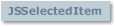

# JSSelectedItem Object

## JSSelectedItem Object

  
 Represents a selected row within a multi-select **GridEX** control.

### Syntax

 *gridex*.**SelectedItems**(*index*)  
 The **JSSelectedItem** object syntax has these parts:

| Part | Description |
| --- | --- |
| *gridex* | An object expression that evaluates to a **GridEX** control. |
| *index* | A Long that represents the index of a **JSSelectedItem** object in the **JSSelectedItems** collection. |

### Remarks

 With a **JSSelectedItem** object, you can get attributes of the individual selected rows in a **GridEX** control.  
 To use a **JSSelectedItem** object, you can use the **SelectedItems** property of the **GridEX** control.

**See Also:** [JSSelectedItems Collection](JSSelectedItems-Collection.md#jsselecteditems-collection), [SelectedItems Property](../Properties.md#selecteditems-property-gridex-control), [Item Property](JSSelectedItems-Collection.md#item-property-jsselecteditems-collection)

## Bookmark Property (JSSelectedItem Object)

Returns a value containing the bookmark of the selected row in a **GridEX** control. Read-only

### Syntax

 *object*.**Bookmark**  
 The object placeholder represents an object expression that evaluates to an object in the Applies To list.

### Remarks

 The **Bookmark** property returns the bookmark of a selected row. If the selected row is a “group row” the **Bookmark** property will return **Null**.

### Data Type

 Variant

**Applies To:** [JSSelectedItem Object](#jsselecteditem-object)  
**See Also:** [RowBookmark Property](../Properties.md#rowbookmark-property-gridex-control)

## RowIndex Property (JSSelectedItem Object)

Returns a value containing the original index of the selected row in a **GridEX** control. Read-only

### Syntax

 object.**RowIndex**  
 The object placeholder represents an object expression that evaluates to an object in the Applies To list.

### Remarks

 The **RowIndex** property returns the original index of a selected row.  
 If the selected row is a “group row” the **RowIndex** property will return 0.

### Data Type

 Long

**Applies To:** [JSSelectedItem Object](#jsselecteditem-object)  
**See Also:** [RowIndex Method](../Methods.md#rowindex-method-gridex-control), [Bookmark Property](#bookmark-property-jsselecteditem-object), [RowPosition Property](#rowposition-property-jsselecteditem-object)

## RowPosition Property (JSSelectedItem Object)

Returns a value containing the current position of the selected row in a **GridEX** control. Read-only

### Syntax

 *object*.**RowPosition**  
 The object placeholder represents an object expression that evaluates to an object in the Applies To list.

### Remarks

 The **RowPosition** property returns the current position of a selected row.

### Data Type

 Long

**Applies To:** [JSSelectedItem Object](#jsselecteditem-object)  
**See Also:** [RowIndex Property](#rowindex-property-jsselecteditem-object), [Row Property](../Properties.md#row-property-gridex-control)  
**Example:** [SelectedItems Example](../../Examples.md#selecteditems-example)

## RowType Property (JSSelectedItem Object)

Returns a value that represents the type of the selected row.

### Syntax

 *object*.**RowType**  
 The object placeholder represents an object expression that evaluates to an object in the Applies To list.

### Settings

 The settings for **RowType** are:

| Constant | Value | Description |
| --- | --- | --- |
|  **jgexRowTypeRecord** | 0 | The selected row represents a record. |
|  **jgexRowTypeGroupHeader** | 1 | The selected row is a group row. |
|  **jgexRowTypeGroupFooter** | 2 | The selected row is a group footer. |

### Remarks

 Use this property to differentiate between actual records and “group” rows that can be expanded or collapsed.

### Data Type

 **jgexRowTypeConstants**

**Applies To:** [JSSelectedItem Object](#jsselecteditem-object)  
**See Also:** [IsGroupItem Method](../Methods.md#isgroupitem-method-gridex-control), [RowType Property](JSRowData-Object.md#rowtype-property-jsrowdata-object)
