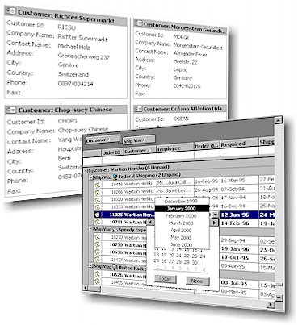

# Janus GridEX 2000 Help

## Contents

- [Full table of contents](index.md)
- [GridEX Control](GridEX-Control.md)
  - [Properties](GridEX-Control/Properties.md)
  - [Methods](GridEX-Control/Methods.md)
  - [Events](GridEX-Control/Events.md)
  - **Objects & Collections**
    - [JSColumn Object](GridEX-Control/Objects/JSColumn-Object.md)
    - [JSColumns Collection](GridEX-Control/Objects/JSColumns-Collection.md)
    - [JSDataObject Object](GridEX-Control/Objects/JSDataObject-Object.md)
    - [JSDataObjectFiles Collection](GridEX-Control/Objects/JSDataObjectFiles-Collection.md)
    - [JSFmtCondition Object](GridEX-Control/Objects/JSFmtCondition-Object.md)
    - [JSFmtConditions Collection](GridEX-Control/Objects/JSFmtConditions-Collection.md)
    - [JSFormatStyle Object](GridEX-Control/Objects/JSFormatStyle-Object.md)
    - [JSFormatStyles Collection](GridEX-Control/Objects/JSFormatStyles-Collection.md)
    - [JSGridImage Object](GridEX-Control/Objects/JSGridImage-Object.md)
    - [JSGridImages Collection](GridEX-Control/Objects/JSGridImages-Collection.md)
    - [JSGroup Object](GridEX-Control/Objects/JSGroup-Object.md)
    - [JSGroups Collection](GridEX-Control/Objects/JSGroups-Collection.md)
    - [JSPrinterProperties Object](GridEX-Control/Objects/JSPrinterProperties-Object.md)
    - [JSRowData Object](GridEX-Control/Objects/JSRowData-Object.md)
    - [JSSelectedItem Object](GridEX-Control/Objects/JSSelectedItem-Object.md)
    - [JSSelectedItems Collection](GridEX-Control/Objects/JSSelectedItems-Collection.md)
    - [JSSortKey Object](GridEX-Control/Objects/JSSortKey-Object.md)
    - [JSSortKeys Collection](GridEX-Control/Objects/JSSortKeys-Collection.md)
    - [JSValueItem Object](GridEX-Control/Objects/JSValueItem-Object.md)
    - [JSValueList Collection](GridEX-Control/Objects/JSValueList-Collection.md)
- [GEXPreview Control](GEXPreview-Control.md)
  - [Properties](GEXPreview-Control/Properties.md)
  - [Methods](GEXPreview-Control/Methods.md)
  - [Events](GEXPreview-Control/Events.md)
- [Appendixes](Appendixes.md)
- [Examples](Examples.md)

## Janus GridEX 2000 Help

 

Copyright ©1998-2000 Janus Systems SA de CV.  
 All rights reserved.
